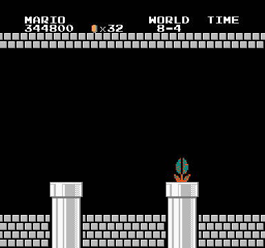
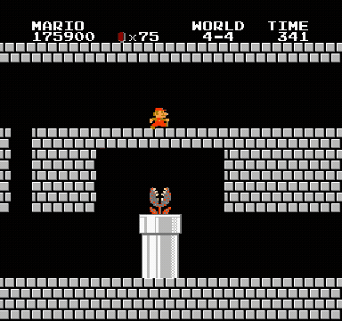
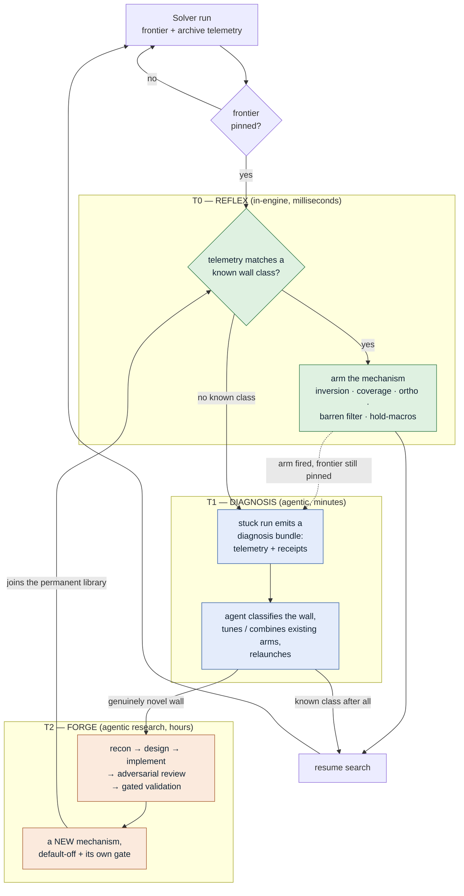
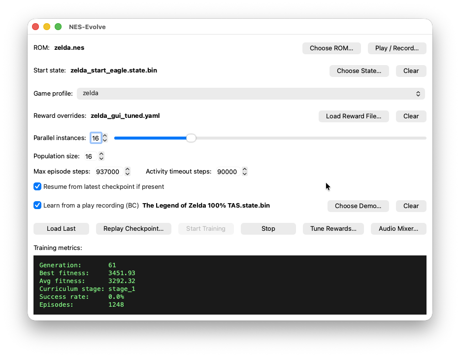
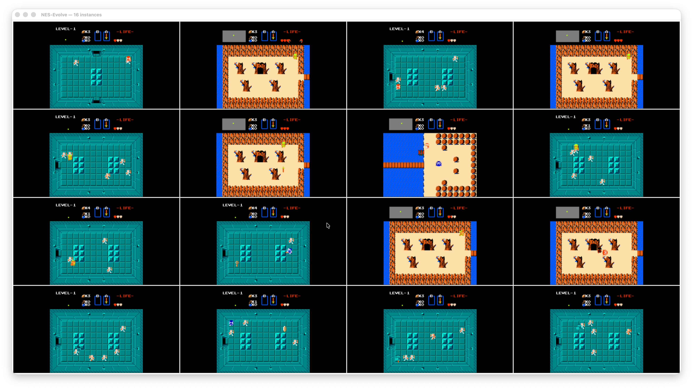
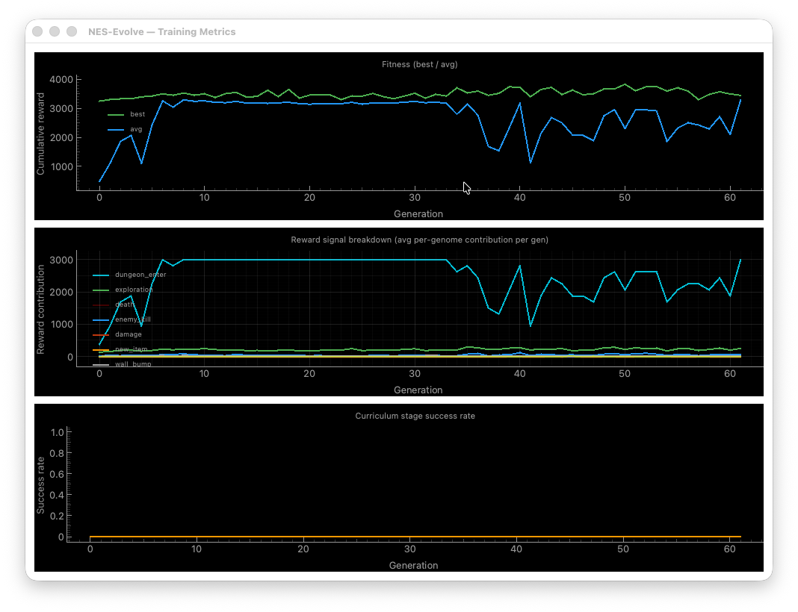
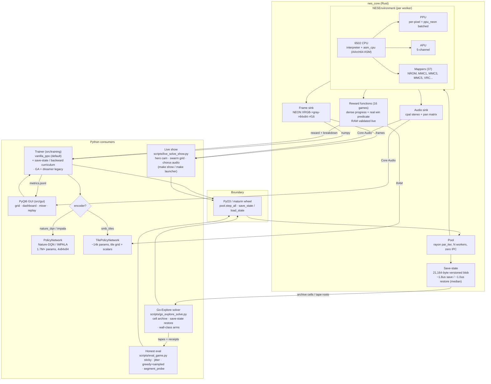
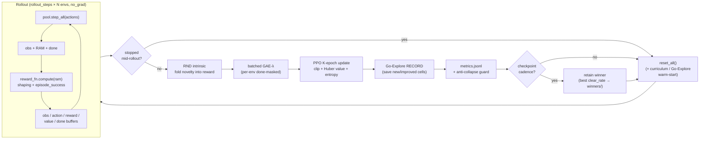
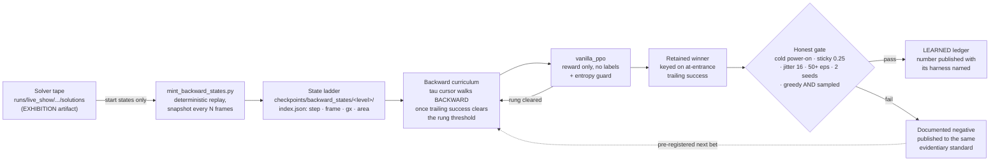
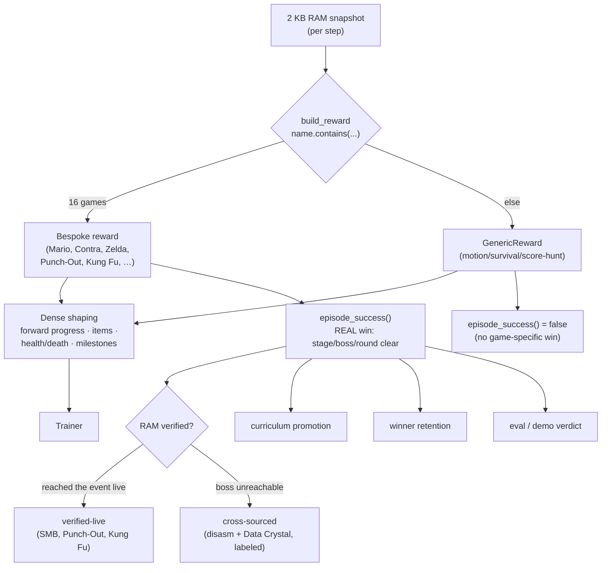

# Neural Entertainment System

A macOS / Apple-Silicon NES emulator built to be pointed at a game and left to
beat it. A purpose-built Rust core (`nes_core`) — Mesen-checked fidelity,
microsecond save-states, 37 mappers, 793 of 796 library ROMs booting into a
live screen — is driven from Python by two systems that share it: a generic
Go-Explore **solver** that searches its way through a game live on stream, and
a PPO **trainer** whose policies are graded by the strictest published
evaluation protocol. The solver has beaten Super Mario Bros end to end — cold
boot to the princess, every input receipted — and the trainer's honest number
on
World 1-1 is 0.65. Those two sentences describe different achievements, they
are filed in different ledgers, and every result below carries the label of
the ledger it belongs to.

Hereafter, **NES** refers to this project (Neural Entertainment System); the
original 1985 console is referred to by its full name to disambiguate.

## Where it stands today

Three headline results. The first two carry ledger labels — `CLAIMS.md` is
authoritative for what each label means and what may be said about it, and
*The claims ledger* below is the short version. The third is the fidelity
floor the other two stand on. Where the project is going next is in
`docs/proposals/TOTALITY_BASIS_2026-08-08.md` (what "any game" would actually
take), `docs/proposals/STRATEGY_2026-08-14.md` (supersedes the day-30 framing),
and `docs/proposals/DIRECTION_2026-08-28.md` (the current direction, with
failable gates).

### 1. [EXHIBITION] The search system beat Super Mario Bros — the whole game

From an actual cold boot (reset, title screen, START press) through all 32
levels to the "THANK YOU MARIO — YOUR QUEST IS OVER" ending, as one verified
controller tape with per-level receipts and a deterministic sha256
([release with video, tape, and receipts](https://github.com/mstits/neural-entertainment-system/releases/tag/smb-complete-v1)).



*The final minutes of the verified run (EXHIBITION — search output, not a
learned policy): 8-4's pipe maze, Bowser's bridge, the axe, the rescue.*

A Go-Explore solver — deterministic Rust emulator, microsecond save-states,
first-return-then-explore over a cell archive — beat **all 32 levels**, and
the whole run is one verified artifact: a single controller tape from an
actual cold boot through every level to the ending. **31,202 inputs, ~35
minutes of gameplay, zero state loads, every level boundary receipted, and a
deterministic sha256 across replays** (`docs/receipts/full_run/receipts.json`
records all of it; `state_loads: 0`, `cold_boot: true`). Re-verified
2026-09-01 on the current build: the tape replays to the ending with all 32
level boundaries matching the receipt
(`docs/receipts/full_run/replay_2026-09-01.json`). The 31 KB tape, per-level
receipts, and ending frame live in `docs/receipts/full_run/`; the three-round
research trail that cracked the looping mazes and the final pipe-maze is in
`docs/research/`.

**It was finished live.** The last stretch — 5-3 through the 8-4 finale —
fell in the streaming show (`make show`) on the night of **2026-07-28/29**,
with 8-4 itself taking 56 minutes and 1.19M archive cells in that sitting
under the coverage recipes
(`runs/live_show/smb_4_4_micro/lvl_8-4/progress.jsonl`). Every
banked level solution was then replayed and re-verified to advance the
world/level pair (`runs/live_show/smb_4_4_micro/chain_verify.json`).

This is the machine *solving* the game, in the tradition of the ALE "Brute"
and the TAS community — real, rigorous, always labeled as search, and never
presented as learning.

**One game beaten so far.** Bubble Bobble is the second campaign in flight
and stands at **round 60** solved and banked
(`runs/bubble_bobble/chain_day2c/chain.jsonl`); Castlevania is at **blocks
0-2 of ~18**. Those are the honest counts, not forecasts.

### 2. [LEARNED] World 1-1, cleared at 0.65 under the honest protocol

The learned ledger's headline is one level, and it is measured under the
research-standard bar — cold power-on, zero test-time state loads, greedy
action selection, 25% sticky actions, 0–16 frame start jitter, single-life
scoring, two seeds, greedy *and* sampled both reported (Machado et al. 2018;
`CLAIMS.md` fixes the episode-count floor at 50 per seed, and every run
declares the count it used).

The campaign's receipt table is reproduced here **in full**, failures
included — these are the same five runs that head
`docs/research/B5_PREREG_2026-08-08.md` (where B4 v2 was still in flight at
the time of writing and its verdict has since landed). Quoting only the
rows that passed would be exactly the highlight-reel move this section
exists to refuse:

| Run | What it measures | Episodes | Result |
|---|---|---|---|
| B1 | 1-1 tile policy, cold greedy, two seeds | 50 + 50 | **0.65 pooled** (0.56 / 0.74 per seed) |
| B2 | the same checkpoint, sampled | 30, one seed | 0.667 — declared below the 50/seed floor |
| B3 | 1-2 probe control (the published negative) | 30 | 0/30 |
| B4 v1 | 1-1 reverse curriculum, first attempt | 50 greedy, 30 sampled, ×2 seeds | **failed the cold gate: 0.02 greedy on both seeds** (0.50 / 0.633 sampled) |
| B4 v2 | the same, winner re-keyed to at-entrance success | 50 greedy, 30 sampled, ×2 seeds | **failed identically: 0.02 / 0.02 greedy** (0.50 / 0.633 sampled) |

B1 is the project's first and so far only true learned clear at this bar,
and it is a **from-scratch PPO** policy on tile observations, not a replay.
Its receipts are the two `action_select: greedy` records dated 2026-08-08
in `checkpoints/mario_1_1_tile_gate_v2_consolidate/eval.jsonl` — 50
episodes each, 28/50 and 37/50 clears, pooling to 65/100. An earlier pair
on a byte-identical copy of the same checkpoint (same sha256, different
filename) — 2026-07-21, 30 episodes per seed, 0.667 /
0.633 — pools to the same 0.65, which is where the "63–67% per seed" band
in older write-ups comes from; at the floor-meeting 50 episodes the
per-seed spread is wider, 56–74%, and that is the honest band. B4's two
rows are evaluated the same way, from
`checkpoints/mario_1_1_backward/eval.jsonl`.

One gap in the receipts themselves, stated rather than left to be found:
`eval.jsonl` records the checkpoint, episode count, clear rate, action
selection, worker count and RNG mode, but **not** `sticky_prob`,
`start_jitter` or `eval_seed`. The noise settings behind these rows come
from the run invocation and the write-ups in `docs/research/`, not from the
receipt file; folding them into the record is an open item.

Two more entries, both carefully qualified:

- **World 1-2 is a documented negative** — and a measured one. A
  pre-registered, externally-reviewed campaign (three concurring seeds)
  showed the CGSA-PPO recipe failing its own pre-registered signposts on
  three seeds (the policy-class generalization was later withdrawn —
  `CLAIMS.md` §World 1-2, `runs/smodice_1_2/`): local robustness verified at
  1,900+ zones by sequential statistical tests does not compose into
  traversal, and the level's central gauntlet has a measured local noise
  ceiling far below the protocol's 25%. On the literature: **we are aware of no published per-level 1-2 clear rate
  under Machado sticky-0.25, in either direction**; the level is an open
  problem at the field's frontier. Full record:
  `docs/research/RESULTS_1_2_HONEST_PROTOCOL_2026-07-24.md`.
- **The composite World-1 playthrough** remains reproducible: per-level
  learned nets behind a router, playing 1-1 through the 1-4 castle live
  from power-on. It is a *composite of specialists* — labeled as such —
  not one agent that understands the game, and its clear is a
  deterministic reproduction, not an honest-protocol number:

  

```bash
python scripts/record_learned_playthrough.py \
  --manifest configs/composite_learned.yaml \
  --out runs/demo/world1 --stop-after-worlds 1
# -> World 1 cleared, no warps, end_reason: seq_clear
```

**The gap, stated plainly, because an honest miss beats a dishonest
highlight reel:** no single learned policy yet plays whole worlds under
honest noise, and 1-2 is measured evidence that getting there needs a
stronger policy class, not more training tricks. The current bet is a
**reverse (backward) start-state curriculum** — the solver's own tape
supplies start states only, never action labels — pre-registered in
`docs/research/B5_PREREG_2026-08-08.md` with its gates, kill criteria, and
honest-reporting clause written down *before* the first episode ran.

**The prior on that bet is bad, and it is the B4 rows above.** The
mechanism has been run twice on 1-1 — the control level this same stack
already learned to 0.65 — and cold-scored **0.02 greedy both times**,
before and after the winner-selection fix; a consolidation pass on top of
it scored 0/25 greedy on two checkpoints. The diagnosis on record is a
sharpening failure rather than an exploration one (the same nets sample
0.50–0.633, reaching within pixels of the pole), which is why the attempt
continues at all. Note what that means procedurally: the prereg gates the 1-2
attempt on the 1-1 control passing ≥ 0.63 pooled greedy cold, and the control
did not pass. `docs/proposals/STRATEGY_2026-08-08.md` (superseded as the plan
of record by `STRATEGY_2026-08-14.md`; current direction in
`DIRECTION_2026-08-28.md`) allows the attempt anyway only as a written
deviation addendum published *before* the run, with the gap carried as a
registered caveat — and that addendum is not written yet. It may fail again;
the prereg says in advance what failing looks like.

### 3. [FIDELITY] Mesen-checked receipts under both of them

Neither ledger means anything on an emulator that drifts. The core is gated by
**nestest byte-exact** (8,991 instructions — registers *and* cycle count,
against the Nintendulator golden trace), a **33-ROM Mesen-oracle lockstep**,
**149 differential parity tests** (`make parity`), and a differential fuzz of
the AArch64 ASM CPU against the pure-Rust interpreter across 240M+ instructions
with zero divergence. 793 of 796 library ROMs boot into a live screen across
the 28 mappers this library exercises (2026-09-01 census: 795 run 300 frames
without a panic or timeout, one truncated dump, two static screens).
Cross-checked against Mesen 2 on 12,000 frames of the banked Super Mario Bros
run (2026-09-01): nes_core and Mesen agree on lives, area, mode and every
level-transition frame; scratch bytes (stack, zero-page temps, OAM buffer)
differ by about 10 per frame idle and 17 median under play. The core is never
claimed byte-identical to Mesen. The honest gap — the full public blargg
gauntlet is not yet run end-to-end as a gate — is stated in *Accuracy status*
below rather than quietly omitted.

The emulator and the honest-evaluation harness are the mature layers; the
single generalist agent remains the expedition ahead.

## The claims ledger

The difference between a policy that learned to play and a trajectory that
was searched for is invisible in a highlight clip. So every artifact and
every number in this repo is filed under exactly one ledger, and the wording
allowed for each is fixed. **`CLAIMS.md` is authoritative** — it carries the
full policy, the knowledge-injection tiers, the quarantine list, and the
documented negatives. This is the summary:

| Ledger | What it covers | What may be said |
|---|---|---|
| **EXHIBITION** | *Play.* Search output: Go-Explore and beam solutions, BC "pilot" clones of a single trajectory, routed replay chains. The completed SMB run is here. | "The *search system* solved it." Never "the AI learned it." |
| **LEARNED** | *Play.* A policy trained by RL and evaluated under the honest protocol: cold power-on, zero test-time state loads, single-life denominators, sticky-actions 0.25 + start-jitter 16, at least 50 episodes on each of two seeds, greedy **and** sampled both declared, action receipts recorded and self-replay verified. | "The agent learned/plays/beat." Only here. |
| **FORGE** | *Machinery, not play.* The system diagnosed its own wall from its own self-measured telemetry and forged a new mechanism — agent-authored, shipped default-off and byte-identical, carrying a stated validation gate and an honest record of whether that gate has been met. | Approved verbs: **diagnosed, forged, built, extended itself**. *learn / learned / learns / learning / self-taught* are **banned** for FORGE-class results, whatever the arm goes on to do. |

FORGE deliberately claims less than it looks like it does: it carries no
clear rate, no episode count and no protocol number. If a forged arm later
clears a level, that clear is an EXHIBITION result logged on its own terms —
the two are never merged into one sentence.

Three more rules keep the ledgers from leaking into each other:

- **A deterministic number is never shown without its sticky number beside
  it**, and every quoted rate names its harness (training telemetry vs. cold
  greedy vs. the sticky pair). Chain rates are reported as measured, with
  the compounding math shown (twelve levels at 0.95 each ≈ 0.54 chained).
- **Negative results carry the same evidentiary standard as positives** and
  are quotable with their data. `docs/research/RESULTS_1_2_HONEST_PROTOCOL_2026-07-24.md`
  is the model: a pre-registered, externally-reviewed falsification.
- **Provenance is enforced by a make target, not by good intentions.**
  `configs/demo_allowlist.txt` is the checked-in list of demo banks cleared
  for Learned-ledger training; the trainer refuses anything else;
  `make provenance-check` verifies the allowlist, the Tier-3 quarantine in
  `checkpoints/QUARANTINE_tier3/`, and that no profile references a
  quarantined artifact. Run it before any Learned-ledger run and before
  publishing any number.

## The complete run





*Three moments from the single verified tape (EXHIBITION — search output,
not a learned policy): the cold boot through the title screen into 1-1; the
4-4 looping maze that defeated coordinate-keyed search until cells learned
direction; and the ending. Full 34:40 video: `runs/full_run/
smb_complete_run.mp4` (re-render anytime with `python scripts/
assemble_full_run.py --video out.mp4`).*

## How it gets unstuck — the three tiers

Beating one game is a result; beating *any* game is an architecture. The
operational form of that architecture is a diagnosis-dispatch loop, and the
design decision that makes it general is **what gets classified: not the
game, the wall.** Game-level classification is a lookup table that ends at
793 rows. Wall-level classification generalizes to games nobody profiled.

Every signal below is **self-measured** — read off the solver's own
telemetry (frontier position, cell-key churn, y-band occupancy, tip
mortality), never from a disassembly, a level map, or a walkthrough. That
boundary is what `CLAIMS.md` Tier 3 bans, and it is why these arms are
allowed to exist at all.

| Telemetry signal | Wall class | Mechanism armed | Where |
|---|---|---|---|
| Deep frontier pinned for N seconds | momentum wall | heuristic inversion — flip action-sampling toward left/down inside a self-measured saturation window | `--inversion-pin-secs` (default 180; `-1` disables) |
| Cell-key churn / self-similar states | coverage wall | coverage recipes — count-based selection, finer cell keys | `--sel-mode count`, `--gx-bucket`, `--y-band` |
| gx pinned while y-bands starve | orthogonal wall | treat a vertical direction as the progress axis | `--ortho up\|down` (default off) |
| Deep tips keep dying at a fixed +N | doomed-tip drain | barren filter — evict cells that never produce novelty | `--frontier-throttle` (default 0 = off) |
| Room byte changes with no progress gradient | discrete transition | sustained-hold macros, auto-derived from the action space | profile `solve.hold_macros`; `derive_transition_macros` |

(Not exhaustive — the door-selection, kill-key and time-bin arms
(`--door-weight`, `--kill-key`, `--time-bins`) exist for combat and
room-graph walls, and compose with the above.)

Every arm ships **default-off or default-identical**: a run that omits the
flags samples bit-for-bit the way the receipted 32-level campaign did, which
is what keeps the banked receipts reproducible. Today exactly one arm
(heuristic inversion) arms itself from telemetry; the rest are still flags a
human sets per run. Closing that gap — self-arming, and narrating the
arming live — is the named next step in
`docs/proposals/TOTALITY_BASIS_2026-08-08.md`.



**Where each tier actually is today.** T0 runs inside the solver loop and is
shipped. T1 is what the operator plus a workflow does by hand — the
productized version (stall watchdog → auto diagnosis bundle → agent
invocation) is scheduled, not shipped. T2 has run end-to-end once: the
`--ortho` arm was diagnosed from a stalled Castlevania run's own selection
telemetry (the deep arm's probability of ever picking a climb cell was
provably 0; 34 of 95 columns had never been explored above y-band 15 across
10.6M steps), then designed, implemented, adversarially reviewed and gated
by agents — with the cell key deliberately left alone so banked archives
stay resumable.

**And it has not been shown to work.** No validation run has been performed;
the hall is still unsolved; the standing prior is ~110M steps and 0 solutions
across five arms. `CLAIMS.md` files that arm as **FORGE-PENDING-VALIDATION**
and permits citing it only as *agent-forged, unvalidated*, with no clear of any
kind attributed to it. The validation run is pre-registered in
`docs/proposals/STRATEGY_2026-08-08.md` (superseded as the plan of record by
`STRATEGY_2026-08-14.md`; current direction in `DIRECTION_2026-08-28.md`) with
its stopping rule declared in advance. That is what the FORGE ledger is for: it
lets the interesting claim be made without letting it borrow credit it has not
earned.

Two invariants keep every tier honest: agents consume only self-measured
telemetry, never game internals; and no arm joins T0 without default-off
byte-identity plus its own validation gate.

## How the machine beat the game — methods and math

Everything below is documented with its ledger label. **EXHIBITION** =
the search system (this is what completed the game). **LEARNED** = policies
trained by RL and judged by the honest protocol (1-1 clear; 1-2 documented
negative). The split follows `CLAIMS.md` and the ALE evaluation literature
[1].

### Go-Explore over a deterministic emulator (EXHIBITION)

The solver is first-return-then-explore [2]: an archive of *cells* maps a
discretized state to the best emulator save-state that reached it, search
repeatedly restores a frontier cell (microsecond restore in the Rust core)
and explores onward with right-biased random bursts. A cell is replaced only
under **domination** — a strictly better score, or an equal score in fewer
steps:

$$\text{replace}(c) \iff s > s_c \;\lor\; (s = s_c \wedge t < t_c)$$

Selection favors rarely-chosen frontier cells; a *deep-frontier arm* biases
draws toward the highest progress coordinate. Standard levels fall in
minutes. The interesting failures — and the mechanisms they forced — were:

- **Looping mazes (4-4, 7-4).** Castle mazes silently warp wrong routes
  backward, so coordinate cells alias first-pass and looped states and the
  frontier saturates (measured: 4-4 pinned at gx≈2064, 1.5M records, zero
  solutions). Two generic mechanisms crack this class. *Direction-aware
  cells* append $\mathrm{sgn}(v_x)$ to the cell key so a backtracking
  maneuver re-traversing visited coordinates is a distinct, explorable cell
  rather than a pruned loop. *Saturation-gated heuristic inversion* flips
  the action-sampling bias toward left/down — the maneuvers a forward
  heuristic structurally prunes — but only inside a self-measured window
  $[g_\text{floor},\, g_\text{pin}+60]$ where $g_\text{pin}$ is the live
  frontier pin and $g_\text{floor}$ is the observed warp destination, and
  only after the frontier has been pinned for 180 s. (Always-on inversion
  measurably sabotages standard levels; the gate was added after it stalled
  an athletic level.) 4-4 fell in 45 minutes, 7-4 in 59, with no per-level
  configuration.
- **The pipe-maze finale (8-4).** Route progress goes through pipes that
  must be *entered*: stand on the pipe, hold Down. A measured
  enterability sweep (settle, hold Down 24 steps, at every reachable 16-px
  bucket) fired transitions at 83 of 320 positions — a behavior stochastic
  play essentially never produces. The solver therefore interleaves a
  scripted settle-and-hold-Down macro (2% of steps, recorded verbatim in
  the trace so replays stay exact). The frontier moved from its
  three-day pin to the ending in 45 minutes.
- **The invisible ending.** SMB's victory screen advances no world/level
  byte — there is no next level — and locks input. The winning run sat in
  the archive for 90 minutes classified as a stall until the frontier state
  was *rendered* and showed the princess. Finales are now detected by the
  operating-mode byte (`$0770`: play = 1, victory = 2, verified
  empirically). Lesson, earned twice: never declare a stall without
  rendering the frame.

### Empirical state discovery — no disassembly, ever (EXHIBITION tooling)

The project bans game internals (disassembly, maps, walkthroughs). When
search needed to understand hidden state, it *measured* it, in the system-
identification tradition [8, 9, 10]:

- **Predicate verification.** Any RAM byte used by search must first pass a
  change-rate measurement (e.g., the community-documented "area pointer"
  `$0750` churns ~6/1000 steps with the scroll engine — an invalidated
  interpretation; the area-type byte `$074E` changes 0.67/1000, only at
  screen transitions — verified and used).
- **Sparse causal probes.** To find state that *decides* an outcome,
  collect same-channel snapshot/label pairs, one-hot the 2048-byte RAM and
  fit an $L_1$-regularized logistic regression [11]:

$$\min_{w,b}\; \frac{1}{N}\sum_{j=1}^{N} \ln\!\left(1+e^{-Y_j (w^\top \Phi(R_j)+b)}\right) + \lambda \lVert w \rVert_1$$

  Surviving coefficients are only *candidates*: each must pass a **causal
  mutation test** — overwrite that single byte in a failing state with the
  passing value and observe the outcome flip. The mutation filter earns its
  keep: in one probe it rejected 100%-holdout-accuracy candidates that were
  collection-channel artifacts, and in another it exposed a "route byte"
  that was actually momentum.
- **Fate probes.** Where no event marker exists, a checkpoint sweep
  collects states at fixed coordinates and rolls each forward under fixed
  scripted continuations; divergence in *fate* localizes where deciding
  state lives before any byte is named.

### The honest evaluation protocol and the learned ledger (LEARNED)

Learned policies are judged by the protocol of Machado et al. [1]: cold
power-on, zero test-time state loads, greedy action selection, 25%
sticky actions, 0–16 frame start jitter, single-life scoring, two seeds, and
greedy and sampled both declared (`CLAIMS.md` sets the episode floor; every
run declares the count it used). Under this bar, **1-1 is learned at 0.65
pooled** (0.56 / 0.74 per seed, 50 episodes each) by from-scratch PPO [12, 13]
on tile observations. **1-2 is a documented negative** with the same
evidentiary standard: a pre-registered three-seed campaign showed the CGSA-PPO
recipe failing its own pre-registered signposts (the policy-class claim was
later withdrawn; see `CLAIMS.md` and `runs/smodice_1_2/`). The machinery built
for that campaign is documented because negative results deserve their math
too:

- **Non-farmable potential shaping.** Reward shaping is potential-based
  [4], with the potential positive-shifted from a search-derived distance
  map: $\Phi(s) = \Phi_\max\,(1 - D(s)/D_\text{start}) \in [0,
  \Phi_\max]$, live transitions shaped by $F = \gamma\Phi(s') -
  \Phi(s)$, and **every non-completing terminal charged $-\Phi_\text{peak}$**
  (the episode maximum). The telescoping sum over any non-completing
  episode is then $\le 0$ — dying, idling, retreating, or hiding in a
  zero-potential region cannot bank shaping; only finishing pays. Each
  clause exists because a trained policy found the exploit it closes
  (documented in `docs/research/DOSSIER_V3_2026-07-23.md`).
- **Per-cell stochasticity curriculum with sequential verification.** Each
  archived cell carries its own sticky probability, annealed toward the
  evaluation level on local mastery ($\hat{p} \ge 0.75$ over a window
  $\Rightarrow p \mathrel{+}= 0.05$), with restarts prioritized by
  $W(c) = (1-\hat{p}_c)^2 + 0.1$. A cell is accepted as robust only by
  Wald's SPRT [5] testing $H_0\!: p \le 0.15$ vs $H_1\!: p \ge 0.60$:

$$\Lambda_m = \sum_i \left[ x_i \ln\tfrac{0.60}{0.15} + (1-x_i)\ln\tfrac{0.40}{0.85} \right],\quad \text{accept at } \Lambda \ge \ln\tfrac{1-\beta}{\alpha} \approx 4.55$$

  Small-sample acceptance gates were measured to pass "welds" whose true
  success was below 1/400; fixed-count claims use the Wilson interval [6]
  instead. The campaign's decisive result: SPRT-verified *local*
  robustness at 1,900+ cells did **not** compose into level traversal —
  three seeds concurring — and we are aware of no published per-level 1-2 clear rate under Machado sticky-0.25, in either direction. The full record and robustness profile:
  `docs/research/RESULTS_1_2_HONEST_PROTOCOL_2026-07-24.md`.

### Verification and receipts

The completed run is reproducible from first principles: a cold boot
(reset, 60-step title wait, START), then 31,202 controller inputs with zero
save-state loads. The assembler verifies every world/level boundary in
sequence and the finale by operating mode, and emits per-level receipts
plus the tape's sha256 — byte-identical across independent replays on the
deterministic core. Artifacts: `docs/receipts/full_run/`.

### References

1. M. C. Machado et al., "Revisiting the Arcade Learning Environment,"
   *JAIR* 61, 2018 — the sticky-actions evaluation protocol.
2. A. Ecoffet et al., "First return, then explore," *Nature* 590, 2021
   (and arXiv:1901.10995) — Go-Explore.
3. T. Salimans & R. Chen, "Learning Montezuma's Revenge from a Single
   Demonstration," 2018 — backward-curriculum restarts.
4. A. Y. Ng, D. Harada, S. Russell, "Policy invariance under reward
   transformations," *ICML* 1999 — potential-based reward shaping.
5. A. Wald, "Sequential Tests of Statistical Hypotheses," *Ann. Math.
   Stat.* 16, 1945 — the SPRT.
6. E. B. Wilson, "Probable Inference…," *JASA* 22, 1927 — the Wilson score
   interval.
7. T. Hester et al., "Deep Q-learning from Demonstrations," *AAAI* 2018 —
   the large-margin demonstration loss used in the 1-2 campaign.
8. A. Anand et al., "Unsupervised State Representation Learning in Atari,"
   *NeurIPS* 2019 (Atari-ARI) — probing RAM-state semantics.
9. A. K. McCallum, "Reinforcement Learning with Selective Perception and
   Hidden State," PhD thesis, 1995 (U-Tree) — sufficient statistics for
   POMDPs.
10. M. Littman, R. Sutton, S. Singh, "Predictive Representations of
    State," *NeurIPS* 2001 — PSRs.
11. R. Tibshirani, "Regression Shrinkage and Selection via the Lasso,"
    *JRSS-B* 58, 1996.
12. J. Schulman et al., "Proximal Policy Optimization Algorithms," 2017;
    and "High-Dimensional Continuous Control Using GAE," 2015.
13. Community SMB-PPO baselines by uvipen, yumouwei, and Kautenja
    (gym-super-mario-bros / nes-py), whose published hyperparameters and
    RAM telemetry conventions (position, world/level bytes) this project
    follows.
14. M. Jiang, E. Grefenstette, T. Rocktäschel, "Prioritized Level
    Replay," *ICML* 2021 — level-granular restart prioritization.
15. S. Kakade & J. Langford, "Approximately Optimal Approximate
    Reinforcement Learning," *ICML* 2002 — restart-distribution policy
    improvement.
16. The TASVideos community — the tool-assisted-superplay tradition that
    the Exhibition ledger's completed run consciously parallels (and is
    labeled alongside, per `CLAIMS.md`).

## What this is

- A Rust NES core — 6502 CPU, PPU, APU, and 37 mappers. The **pure-Rust
  interpreter is the correctness reference** and what gates fidelity:
  **nestest** validates 8,991 CPU instructions byte-for-byte — registers *and*
  cycle count (CYC) — against the Nintendulator golden trace, and a **33-ROM
  Mesen-oracle lockstep** plus the rest of the **149-test parity gate**
  (`make parity`) diff `nes_core` against Mesen / nes-py frame-by-frame,
  including 17 recorded tapes checked for both golden-diff and determinism.
  A hand-written
  **AArch64-assembly 6502 core** (`nes_core/src/cpu_asm.s`) rides on top as an
  Apple-Silicon *performance* path — enabled in the maturin/Makefile build,
  differential-fuzzed against the interpreter for 240M+ instructions with zero
  divergence, and falling back to the interpreter for any unported opcode. (The
  full public blargg CPU/PPU/APU test-ROM gauntlet is **not yet run** end-to-end
  — see *Accuracy status* below.)
- Broad compatibility: as of the 2026-09-01 library scan, **793 of 796 ROMs
  (99.6%)** boot into a live screen across **28 of the 37 supported mappers**
  present in the library; 795 run 300 frames without a panic or timeout, two
  boot to a static screen (Jackal, SMB+Tetris+NWC), and the one load failure
  is a truncated dump.
  Unsupported mappers and malformed headers fail cleanly at load time with a
  `RuntimeError` instead of crashing the trainer.
- A reinforcement-learning trainer that runs many NES instances in parallel
  through a zero-IPC rayon worker pool, learns a policy with PPO, and lets you
  watch it live in a PyQt6 GUI or reproduce a result headless from the command
  line.
- A generic **Go-Explore solver** (`scripts/go_explore_solve.py`) that shares
  the same pool and save-states, plus the **live show**
  (`make show` / `make launcher`) that runs it in a window with a hero cam,
  a worker swarm grid, and the emulator's real APU audio — the search itself
  is the spectacle.
- An **honest-evaluation harness** (`scripts/eval_game.py`,
  `scripts/segment_probe.py`) with the protocol knobs as first-class flags:
  `--sticky-prob`, `--start-jitter`, `--action-select {greedy,sampled}`,
  `--eval-seed`, `--eval-rng`, `--eval-workers`.

Everything the trainer touches per step — emulation, reward, frame preprocess,
depth tracking — lives on the Rust side behind a single PyO3 call. The Python
side owns PyTorch (MPS) inference and the GUI.

## Screenshots


*Main control window — ROM selector, training start/stop, curriculum stage,
behavior-cloning warm-start picker.*


*Live frame grid for all worker NES instances during training. Each tile is a
separate reinforcement-learning environment running in parallel through the
rayon worker pool.*


*Per-iteration metrics: best/average fitness, success rate, and the per-step
timing breakdown (emulation / forward pass / inference / bookkeeping).*

## Requirements

- macOS on Apple Silicon (M1/M2/M3/M4). Portable fallbacks compile but are not
  the primary target.
- **Python 3.11** (`brew install python@3.11`).
- Rust toolchain (`rustup`) and the Xcode Command Line Tools — the installer
  checks for both and tells you how to get them.
- Your own legally-owned NES ROMs. **None are distributed with this project.**

## Install

```bash
git clone <your-fork-url>
cd macos-emulation-and-training

# Creates .venv, installs Python deps, builds the Rust nes_core wheel via
# maturin, and (if ROMs are present) applies PGO for ~81% more throughput.
bash scripts/install_macos.sh

source .venv/bin/activate
```

The installer verifies the PyTorch **MPS** backend and the `nes_core` import
before finishing. To exercise the Python stack without supplying any ROM, run
the test suite:

```bash
make test
```

If you only want to (re)build the Rust core:

```bash
make build            # release build, features "python,asm_cpu"
make build-pgo        # + 3-stage instrument -> profile -> rebuild (~3 min)
```

Build features worth knowing:
- `python` — PyO3 module + cpal audio (set by maturin).
- `asm_cpu` — AArch64-assembly 6502 core: an Apple-Silicon *performance* path
  (on in the maturin/Makefile build; the pure-Rust interpreter remains the
  fidelity reference and is what `cargo test` exercises).
- `simd` — NEON palette and audio paths.
- `metal` — experimental Metal compute shim (off by default; see docs).

### Quickstart — the make targets

The whole dev loop is local. `make help` prints this list from the Makefile
itself; these are the ones worth knowing:

| Target | What it does |
|---|---|
| `make setup-check` | Verify venv + `nes_core` + torch MPS, and list which per-game ROMs are present under their exact expected filenames. **Run this first.** |
| `make setup-game GAME=mario` | Validate/hash a game's ROM and capture its start state in one step. |
| `make train GAME=mario` | Headless training with the game's default profile; checkpoints to `checkpoints/<game_slug>/`. |
| `make eval GAME=mario` | Load the retained winner, run eval episodes, report clear rate + furthest stage. |
| `make demo GAME=mario` | Play the best checkpoint and record a GIF. |
| `make gui` | Desktop GUI — pick a ROM and profile, watch training live. |
| `make show` | **Beat the Game (Live):** the search system plays SMB from power-on through 8-4 in a window. `make show GAME=contra` or `make show PROFILE=configs/castlevania.yaml` for others. |
| `make launcher` (`make control-panel`) | The show control panel: browse every game and its banked wins, edit every knob, save/load profiles, launch in Live Solve or Replay mode. |
| `make scoreboard` | Mission control: progress across every game trained. |
| `make test` / `make test-fast` | Full pytest suite / the same minus slow tests. |
| `make selftest` | GUI widget construction, headless (offscreen Qt). |
| `make selftest-learning` | Real-loop guard: `vanilla_ppo` actually learns SMB (~25 s). |
| `make parity` | The `nes_core`-vs-nes-py/Mesen differential gate (under 2 min). |
| `make pool-test` | The Rust pool/spectator/frame-anchor tests behind `--features python`, which plain `cargo test --lib` cannot link. |
| `make provenance-check` | Claims gate: demo allowlist, Tier-3 quarantine, and no profile referencing a quarantined artifact. |
| `make build` / `make build-pgo` / `make build-pgo-apply` | Release build / full 3-stage PGO (~3 min) / reapply the cached profile (~15 s). |
| `make bench` `bench-hot` `bench-scaling` `bench-phases` `bench-all` | Micro-benches, hot-path breakdown, worker-count sweep, CPU-vs-PPU split. Thermal-sensitive: run on a cool machine. |

## Train a game

The end-to-end loop is: **supply a ROM → capture a start state → train → eval →
watch.** Everything below uses commands that exist in the `Makefile` and
`scripts/`. Run `make setup-check` first — it verifies your environment (venv,
`nes_core`, torch MPS) and lists exactly which per-game ROMs are present or
missing under their expected filenames. Once a ROM is in place,
`make setup-game GAME=<name>` validates it by MD5 and captures its start state
in one step (combining steps 1–2 below).

### 1. Supply the ROM

Drop your legally-owned ROM into `roms/` under the canonical filename the
launcher expects (`roms/` is gitignored — nothing you put there is ever
committed or shipped):

| game | `--game` | expected ROM path |
|------|----------|-------------------|
| Super Mario Bros. | `mario` | `roms/Super Mario Bros. (World).nes` |
| Contra | `contra` | `roms/Contra (USA).nes` |
| Mega Man 2 | `megaman` | `roms/Mega Man 2 (USA).nes` |
| Castlevania | `castlevania` | `roms/Castlevania (USA).nes` |
| The Legend of Zelda | `zelda` | `roms/Legend of Zelda, The (USA) (Rev A).nes` |
| Metroid | `metroid` | `roms/Metroid (USA).nes` |

(Point at any file with `--rom /path/to/rom.nes` if your filename differs.)

### 2. Capture a start state

Without a start state, the emulator cold-boots to the **title screen**, where
the attract-mode demo auto-plays and ignores controller input — training there
gives zero learning signal. This one-time step boots the ROM, mashes through the
menus, and snapshots the moment the player becomes controllable, writing
`roms/<rom_stem>_start.state.bin` (the sidecar the launcher and profiles use):

```bash
python scripts/capture_start_state.py --game mario
```

### 3. Train

```bash
make train GAME=mario
```

This runs `scripts/train_game.py` headless with the game's default profile —
for Mario that is `configs/mario_vanilla_ppo.yaml`, the **vanilla PPO** recipe
(single shared policy, N parallel environments as rollout collectors, batched
GAE, K-epoch PPO update). It auto-resumes from the latest checkpoint by default;
pass `--no-resume` through the script for a fresh run.

Per-game checkpoints land in `checkpoints/<game_slug>/` (for Mario,
`checkpoints/super_mario_bros/`) as `vanilla_ppo_iter_NNNNN.pt`, written every 10
iterations. What you will see on stdout, roughly:

```
[launcher] profile=mario_vanilla_ppo.yaml game=Super Mario Bros. num_envs=60 iters=10000 resume=True
[launcher] checkpoint_dir = checkpoints/super_mario_bros
iter 12 | ppo loss=0.031 policy=-0.004 value=0.048 entropy=1.71 | rnd=0.92
  max-W-L: 1-1=41  |  end-W-L: 1-1=41  |  curriculum stage=0 (anchor area=0, 0/60 envs past stage)
...
```

The curriculum line is the one to watch on Mario: as the pool learns to clear a
level it snapshots the worker state at the new stage boundary and warm-starts
all envs from it, so `curriculum stage` climbs 0 → 1 → 2 as it advances through
1-1 → 1-2 → 1-3 in training. (These are training-time clears; the honest
cold-start sticky eval is a separate, lower number — see *What actually works
today*.) Stages persist to `checkpoints/super_mario_bros/smb_curriculum/` so
restarts resume mid-curriculum.

Want to watch it train live instead of headless? Launch the GUI, pick the ROM,
and hit start:

```bash
python -m src.gui.main
```

### 4. Reproduce a win (eval)

```bash
make eval GAME=mario
```

Loads the best **retained winner** (`checkpoints/<game_slug>/winners/best.pt` —
the highest-clear-rate policy the run ever produced, kept even if training later
self-collapses), falling back to the best-eval-scoring checkpoint and then the
latest. It runs greedy (argmax) episodes and prints a JSON summary — clear rate,
furthest stage reached (`mean_max_byte`), mean return and length — appending a
row to `checkpoints/<game_slug>/eval.jsonl`. By default it boots from the
profile start state and measures the first stage; to score a later curriculum
stage, run the script directly:

```bash
python scripts/eval_game.py --game mario --stage 2 --episodes 30
```

For a bird's-eye view across every game you've trained:

```bash
make scoreboard
```

### 5. Watch it win

```bash
make demo GAME=mario
```

Plays back the retained winner as a short GIF under `checkpoints/<game_slug>/`,
so the flagship "watch it win" moment shows a real clear — not whatever the
latest (possibly self-collapsed) checkpoint happens to be. `--latest` forces the
freshest checkpoint and `--iter N` pins an exact one.

For a bit-for-bit reproducible run, pass `--seed` to the launcher
(`python scripts/train_game.py --game mario --seed 0`); the seed and the ROM's
whole-file MD5 are recorded in `checkpoints/<game_slug>/run_manifest.json`.

## What actually works today

Honest, evidence-based status, split by the ledgers defined in `CLAIMS.md`
and summarised under *The claims ledger* above. This repo ships the
**emulator, the solver, the trainer, and the harnesses** — it does not ship
pre-trained checkpoints (they are gitignored; you train them with the flow
above).

- **Super Mario Bros. — LEARNED, honest cold-start numbers.** Under the
  only headline protocol (cold power-on, zero test-time state loads,
  sticky-actions 0.25 + start-jitter, single-life, greedy), **1-1 is
  genuinely learned: 0.65 pooled clear rate** (0.56 / 0.74 per seed at 50
  episodes each; 0.667 sampled at 30, declared below the floor) by
  from-scratch PPO on tile observations — the project's first true clear at
  the research-standard bar, and the only one. The reverse-curriculum attempt
  to extend it has so far scored **0.02 greedy on 1-1 twice** (see the
  receipt table above). **1-2 is a measured negative**: a pre-registered
  three-seed campaign showed the CGSA-PPO recipe failing its own
  pre-registered signposts there (SPRT-verified local robustness at 1,900+
  zones does not compose into traversal; the policy-class claim was withdrawn
  — `runs/smodice_1_2/`), and we are aware of no published per-level 1-2
  clear rate under Machado sticky-0.25, in either direction under this
  protocol. The full falsification record and the measured robustness
  profile across noise levels live in
  `docs/research/RESULTS_1_2_HONEST_PROTOCOL_2026-07-24.md`. Negative results
  carry the same evidentiary standard as positives here.
- **Super Mario Bros. — EXHIBITION (search, not learning): THE COMPLETE
  GAME.** The Go-Explore solver beat all 32 levels, and the full run is a
  single verified artifact: **one controller tape from an actual cold boot
  (reset, title screen, START) through every level to the "THANK YOU
  MARIO" ending — 31,202 inputs, ~35 minutes of gameplay, zero state loads,
  every level boundary receipted, deterministic sha256 across replays**
  (`docs/receipts/full_run/`: the 31 KB tape, per-level receipts, ending
  frame; assembler: `scripts/assemble_full_run.py`). Both silently-looping
  mazes fell to direction-aware cells plus saturation-triggered exploration
  inversion; the final pipe-maze fell to a measured pipe-entry macro; the
  ending itself had to be *discovered* (the victory screen is invisible to
  next-level detectors — the campaign's last lesson). The research trail —
  three consultation rounds, every falsified hypothesis — lives in
  `docs/research/`. All of this is the *search system* solving the game —
  real and rigorous, always labeled, never presented as learning.
- **Other games — EXHIBITION, in flight, counted honestly.** The same
  unmodified solver drives every campaign; only the profile changes.
  **Bubble Bobble** is chained and banked through **round 60**
  (`runs/bubble_bobble/chain_day2c/chain.jsonl`). **Castlevania** stands at
  **blocks 0-2 of ~18** — the block-3 hall is a genuine open wall, not a
  formality, and the honest statement is the block count, not a percentage.
  **Contra** has ten campaigns with empty `solutions/` directories
  (`runs/breadth_contra/`); its stage-1 base wall is characterized in
  `docs/receipts/contra_wall_dossier_2026-07-31.md` and it is a research
  lane, not a pending win. **Lost Levels** cleared World 1 and 2-1 cold with
  zero new solver code, which is the transfer result that mattered.
- **16 games have hand-authored reward functions with real win predicates** —
  Mario, Contra, Castlevania, Mega Man, Metroid, Zelda, Tetris, Bubble Bobble,
  Punch-Out, Kung Fu, Gradius, Excitebike, Ghosts'n Goblins, DuckTales, Kid
  Icarus, Double Dragon. Every reward's RAM addresses are validated against the
  live emulator (drive the game, diff RAM); `episode_success()` is a genuine
  win (stage/match/floor/round clear or game beaten), never a "positive
  cumulative reward" proxy. **Win RAM verified live** (reached the event on the
  emulator) for SMB, Punch-Out, and Kung Fu; the rest key on reachable RAM with
  the final-boss values cross-sourced (labeled in-code) until an agent or a
  near-boss save-state reaches those endgames. **These make the games trainable
  and measurable. SMB 1-1 is the first LEARNED cold-start clear under the
  honest protocol; no other game has one yet — winning them for real is a
  matter of training compute plus the sticky-robustness research, not
  missing code.**
- **DreamerV3 world-model trainer — scaffolded and trains end-to-end**, but has
  not been converged to outperform PPO on these games; it is a research path,
  not a shipping result.

The emulator itself is the mature layer: byte-exact CPU (nestest, registers +
CYC), the 149-test parity gate green, a 33-ROM Mesen-oracle lockstep, ~99.9%
library boot compatibility, and a differential fuzz of the ASM core against the
pure-Rust reference with zero divergence over 240M+ instructions. Recent
fidelity fixes (MMC5/MMC1-SUROM/MMC3 banking, PPU forced-blank backdrop +
color-emphasis, OAM-DMA bus routing) were validated against Mesen as the
ground-truth oracle, and the whole change set was put through an adversarial
regression review.

**Accuracy status (the honest gap).** What *passes today*: nestest byte-exact
including cycle count (CYC), the 33-ROM Mesen-oracle lockstep
(`tests/parity/test_mesen_lockstep.py`), and the 149-test parity gate (`make
parity`). What is **not** yet done: the full public **blargg CPU/PPU/APU
test-ROM gauntlet** has not been run end-to-end as a gate. Individual blargg
ROMs have been read during fidelity work, but "passes the blargg suite" is not
a claim this project has earned suite-wide — running that gauntlet is open work,
not a shipped result.

### Game readiness

| Game | Reward + win predicate | Start state | Win RAM |
|---|---|---|---|
| Super Mario Bros. | ✅ flagpole + castle (world-byte) | ✅ | **verified-live** |
| Punch-Out!! | ✅ match-id KO/TKO latch | ✅ | **verified-live** |
| Kung Fu | ✅ floor-clear + Sylvia | ✅ | **verified-live** |
| Contra | ✅ per-stage clear ($0030/$003B) | ✅ | cross-sourced |
| Castlevania | ✅ Dracula (final block) | ✅ | cross-sourced |
| Metroid | ✅ Mother Brain + escape | ✅ | reachable RAM |
| Zelda | ✅ Ganon / ending song | ✅ | reachable RAM |
| Mega Man (2) | ✅ shaping (no all-Masters flag) | ✅ | n/a (no game-win flag) |
| Bubble Bobble | ✅ round-clear | ✅ | round-clear observed live (solver chained to round 60) |
| Tetris | ✅ line-goal | ⚠ capture | cross-sourced |
| Gradius / Excitebike / Ghosts'n Goblins / DuckTales / Kid Icarus | ✅ stage/track/level clear | ✅ | live-validated addrs |
| Double Dragon | ✅ mission-clear | ✅ | cross-sourced |

## Architecture

One Rust core, one PyO3 boundary, five things built on top of it: the
solver, the trainer, the eval harness, the live show, and the desktop GUI.
Everything below the boundary runs per step in Rust — emulation, reward,
frame preprocess, depth tracking — behind a single call.



**Trainer modes.** `vanilla_ppo` is the default and the recommended recipe: one
shared policy, N parallel envs as rollout collectors, batched GAE, K-epoch PPO.
The older **GA-based modes** (`ga_ppo`, `pure_ppo`) — PPO on top of a genetic
algorithm with a population of policies — are **legacy**: a two-day
investigation found that folding data from many distinct policies into one PPO
gradient violates PPO's stable-policy assumption and never produced a committed
clear. They remain selectable via `reinforce.trainer_mode` for comparison.

### Training loop (vanilla_ppo)

One shared policy; N parallel NES envs are rollout collectors. Two optional,
mutually-exclusive exploration aids sit on top: the **SMB save-state
curriculum** (warm-start the pool at progressively later captured states) and
**Go-Explore** (archive the furthest-reached cells as save-states, return to the
frontier, then explore onward — the lever that cracked the SMB 1-4 Bowser fight).



### The learning pipeline — solver tapes to an honest number

The solver and the trainer are not two products; the solver is the trainer's
exploration front-end. A banked solution tape is replayed deterministically
and snapshotted every N frames into a **state ladder**; a reverse curriculum
(Salimans & Chen, arXiv:1812.03381) starts training a few frames from the
goal and walks the restart cursor `tau` **backward** along that ladder as
each rung is earned, until it is starting from the true entrance. Only then
is the policy graded, cold, from power-on.

**This pipeline has not yet produced a passing number.** It is described
here because it is what is wired and running, not because it works: its
only two verdicts to date are B4 v1 and B4 v2 above, both 0.02 greedy cold
on 1-1. Read the diagram as the machinery under test, with the honest gate
at the end being the part that has actually done its job — it rejected
both.

The load-bearing constraint: **the tape supplies start states only — no
action labels leave `scripts/mint_backward_states.py`.** Nothing here feeds
imitation, because naive BC on these same tapes was eliminated with data in
Dossier v3 (clone accuracy 1.0 collapsing to 0.00 honest success). This is
the Nature Go-Explore recipe, disclosed as a Tier-1 injection in `CLAIMS.md`.



Every gate on that last edge is written down before the run, not after:
`docs/research/B5_PREREG_2026-08-08.md` is the live example — thresholds,
kill criteria, the greedy-and-sampled reporting clause, and an explicit
statement that a run stopped by a kill criterion *is* a reported result.

### Reward and win-predicate flow

Every game's reward reads the worker's RAM snapshot and emits (a) dense shaping
that must be dominated by (b) a **real `episode_success()` win predicate** on
validated RAM — never a "positive cumulative reward" proxy. `episode_success`
feeds curriculum promotion, winner retention, and the eval/demo "did it win?"
verdict, so a wrong predicate silently corrupts all three (the bug class this
project hunts).



## Performance

Measured on an M4 Max MacBook Pro against nes-py (LaiNES C++) on Contra. Your
numbers will vary with chip, macOS version, and background load.

- `fs=1` single-env, full render: **0.72–0.75×** nes-py. LaiNES still wins this
  workload; the per-pixel bandwidth gap is the last open lever.
- `fs=4` single-env: **1.23–1.25×** nes-py. Beats parity.
- `fs=4` 12-parallel (training workload): up to **3.72×** nes-py.
- `fs=16` 12-parallel (aggressive RL cadence): up to **3.58×** nes-py.

Parallel training throughput is the headline number and the workload the trainer
actually runs. Reproduce with `make bench-scaling` / `make bench-hot`.

**Save/restore latency** (full 21,164-byte `nes::State` blob; benched in
`runs/emulator_bench_2026-07-20.json` via `scripts/bench_save_restore.py`):
**median save ~1.8 µs / restore ~1.0 µs, p99 save ~4.7 µs / restore ~1.3 µs** at
one worker, and it holds at 16-worker scale (**p99 save ~4.7 µs, restore
~2.1 µs**) — so "microsecond save/restore at scale" is now measured, not
asserted. Honest caveat: that run was under a concurrent ~11-core training load,
and the *mean* is inflated by rare OS-preemption outliers (a few multi-ms tail
events), so the median/p99 above — not the mean — describe the common case.

## Compatibility

The full matrix lives in `reports/full_library.md`. A summary:

- **37 mappers** implemented, covering **99.5%** of the 796-ROM library
  (live-screen boot, 2026-09-01 census). Every supported mapper passes at
  100% on its carts.
- Discrete logic: NROM (0), UxROM (2), CNROM (3), AxROM (7), Colordreams (11,
  66), CPROM (13), BNROM / NINA-001 (34), Caltron 6-in-1 (41), NINA-06 / HES
  (113), Action 52 (228), Camerica Quattro (232), Maxi 15 (234), Camerica
  BF9093 (71), Nina-03 / NAMCOT-00301 (79).
- MMC family: MMC1 / SxROM (1), MMC3 / TxROM (4), MMC5 / ExROM (5), PxROM / MMC2
  (9), MMC4 / FxROM (10), TxSROM (118), TQROM (119), NWC 1990 (105), NES-ZZ
  multicart (37), NES-QJ multicart (47).
- Konami VRC: VRC2a (22), VRC2b (23), VRC4 (21, 25), VRC6 (24, 26), VRC7 (85).
- Namco + Sunsoft + Tengen: N163 (19), Sunsoft-4 (68), FME-7 (69), Tengen
  RAMBO-1 (64).
- Unsupported mappers and malformed headers raise a clean `RuntimeError` at load
  time. Check programmatically with `nes_core.supported_mappers()`.

## Features

**Emulator core**
- Full Rust NES core: 6502 CPU, PPU, APU, 37 mappers, versioned save state
  (`NCST\x01` magic).
- AArch64 assembly 6502 core behind `asm_cpu`. 99.97% hit rate on real ROMs;
  falls back to the pure-Rust core for unported opcodes.
- Batched PPU via NEON SIMD with mid-scanline fallback for state changes the
  batched path cannot capture.
- Rayon-based in-process worker pool. No IPC, no shared memory, no pickling.
- PGO build pipeline (`scripts/pgo_build.sh`) with 3-stage instrument → profile
  → rebuild.
- macOS-native audio via cpal. 5-channel pan matrix, per-channel resampler
  (43653 Hz → 44100 Hz).

**Training stack**
- **Vanilla PPO (default).** Single shared policy, N parallel envs, batched
  GAE, K-epoch update — the literature recipe that empirically clears SMB 1-1.
- **Save-state curriculum** (SMB): auto-snapshots the pool when it reaches a new
  level and warm-starts every env from it, advancing stage by stage.
- **Two policy architectures** dispatched by `reinforce.encoder`:
  - **Nature-DQN CNN** or **IMPALA ResNet** on stacked pixels. Universal — works
    on any ROM with no per-game code. ~1.7M–3.4M params.
  - **Tile-based MLP** (SMB) — reads RAM directly into a 13×13 semantic tile
    grid + scalars. ~14k params. Shrinks the search space ~120× so PPO
    gradients can actually steer the policy.
- **Dense reward shaping** for SMB — RAM-readable progress checkpoints fire
  bonuses at each major obstacle, giving PPO intermediate signal instead of one
  sparse flag reward.
- **Auxiliary losses & exploration helpers**: RND intrinsic motivation, DrQ
  random-shift augmentation (pixel mode), symlog reward transform, optional
  elite-diversity preservation.
- **DreamerV3 world-model trainer** as an alternative (`training_mode: dreamer`)
  — categorical 32×32 latent RSSM, decoder reconstruction, λ-returns on imagined
  rollouts, Polyak-EMA target critic, atomic checkpointing with auto-resume.
- **Legacy GA modes** (`ga_ppo`, `pure_ppo`) — PPO on a genetic algorithm with
  behavior-cloning warm start; kept for comparison, not the recommended path.
- **PyTorch MPS** policy training. **Core ML export** for elite genomes; ANE
  inference in replay (~8× faster than MPS at batch 1).

**Observability**
- **TrainingDashboardWindow** — single-pane observer view: best/avg fitness,
  reward signal stack, PPO learning telemetry, world-model losses, depth +
  curriculum success, replay-buffer fill, depth records, highlight clips, and a
  live world-model reconstruction strip (original vs. decoded frames).
- **Live frame grid** for all N workers, **reward-tuning sliders**, an **audio
  mixer** with per-worker solo, **replay and play windows**, and an
  **auto-clip highlight recorder** that flushes the last 4 seconds of any worker
  that triggers a banner event to `highlights/*.mp4`.

## Testing and validation

Correctness here is a gate, not a vibe. Everything runs locally; nothing
depends on a hosted runner.

```bash
make test        # ~1,730 pytest tests (tests/, 120s timeout) — no ROM needed
make test-fast   # the same minus 31 slow tests — the inner loop
make selftest    # GUI widget construction, headless (offscreen Qt)
make parity      # 149 nes_core-vs-nes-py/Mesen differential tests (< 2 min)
make pool-test   # Rust pool/spectator tests behind --features python

# Rust (includes nestest CPU validation: 8,991 instructions byte-exact)
cd nes_core && cargo test --all-features

# Library-wide sweeps (~3 min each; require ROMs in roms/)
python scripts/playability_sweep.py    # boots but doesn't progress
python scripts/parity_sweep.py         # RAM divergence vs nes-py
```

What the numbers are, as of this writing:

| Gate | Size | What it catches |
|---|---|---|
| `make test` | ~1,730 pytest tests (1,700 in the fast lane) | Trainer, solver, eval-harness, reward, GUI-adjacent logic |
| `make parity` | 149 tests — 17 recorded tapes × 2 checks (golden diff + determinism), a **33-ROM Mesen-oracle lockstep**, an 18-case byte-exact ROM fleet, plus the harness's own units | Palette, scroll, sprite, timing and mapper regressions against a ground-truth oracle |
| nestest | **8,991 instructions byte-exact** — PC, opcode, A/X/Y/P/SP **and CYC** vs the Nintendulator golden trace | The CPU spec itself; every official and undocumented opcode |
| Rust crate | 329 in-crate `#[test]` functions + 60 integration tests | Mappers, PPU/APU state machines, save-state round-trips, pool behavior |
| ASM differential fuzz | 240M+ randomized instructions, **0 divergences** in A/X/Y/SP/P/PC or the 2 KB RAM FNV-1a hash | The AArch64 performance path drifting from the pure-Rust reference |
| `make provenance-check` | allowlist + quarantine + profile scan | Tier-3-contaminated artifacts leaking into a Learned-ledger run |

Five validation layers, each catching a different class of bug — see
`docs/ARCHITECTURE.md#validation-harnesses` for the pyramid. In short:
**nestest** is the CPU spec gate; the **byte-exact ROM fleet** is the strictest
end-to-end test; the **playability sweep** catches games that boot but don't
progress (the layer that surfaced both the Bill & Ted's and Zelda boot bugs).

Beyond the code gates, the *result* gates: the honest protocol
(`scripts/eval_game.py` with `--sticky-prob 0.25 --start-jitter 16
--action-select {greedy,sampled}`, two seeds, the episode floor set by
`CLAIMS.md`) is what decides whether a number may be called LEARNED, and
pre-registration
(`docs/research/B5_PREREG_2026-08-08.md`) is what decides whether it may be
called a result at all. See `nes_core/SECURITY.md` for the latest fuzz soak
numbers.

## Limitations and roadmap

What this release **does** ship:

- A fast Rust NES emulator with 37 mappers (793/796 ROMs boot to a live
  screen), byte-exact CPU validation via nestest (8,991 instructions,
  registers + cycle count) and a 33-ROM Mesen-oracle lockstep, plus an
  AArch64 ASM 6502 core (differential-fuzzed against the pure-Rust
  interpreter for 240M+ instructions, zero divergence).
- The training stack: rayon worker pool, vanilla-PPO trainer (default) with
  save-state and backward curricula, tile and pixel-CNN encoders, RND
  exploration, a DreamerV3 scaffold, and Core ML export.
- The generic Go-Explore solver, its wall-class arms, the state-ladder minting
  pipeline, and the live show + control panel.
- Validation gated by `make parity` (149 tests) and the nestest CPU harness;
  claims gated by `make provenance-check` and the honest-eval harness.

What this release **does not** ship:

- **Pre-trained checkpoints.** Checkpoints are gitignored; train them yourself
  with the flow above. On SMB, the honest learned result to date is **1-1 at
  0.65 pooled** (0.56 / 0.74 per seed) under the full sticky protocol (1-2 is a
  documented, three-seed-verified negative for this policy class); the 32-level
  traversal that exists is EXHIBITION (search output), not a learned policy —
  see *What actually works today*.
- **A clearing Contra policy.** Contra learns under the pixel-CNN + RND recipe
  but does not yet clear stage 1; value-loss tuning is the open lever.
- **Tile encoders for games other than SMB.** The framework
  (`src/emulation/tile_observations/`) is generic; each new game needs a per-game
  RAM decoder (~1 day of NESdev-wiki reading). The other games train on the
  universal pixel-CNN path meanwhile.
- **A converged DreamerV3 policy.** The world-model scaffold trains end-to-end
  but has not been converged to beat PPO on these games — open research.
- **All 796 library ROMs booting.** One load failure (`Yoshi (USA).nes`) is a
  truncated dump, not an emulator bug; two ROMs (mappers 2, 37) load but
  freeze on a static screen and are open emulator issues.
- **A completed public accuracy gauntlet.** nestest (registers + CYC), the
  33-ROM Mesen-oracle lockstep, and the 149-test parity gate pass; the full
  public **blargg CPU/PPU/APU test-ROM suite** has not yet been run end-to-end
  as a gate (see *Accuracy status*).
- **A second game beaten.** SMB is the one completed game. Bubble Bobble is
  chained to round 60 and Castlevania to blocks 0-2 of ~18 — both in flight,
  both EXHIBITION, neither finished.
- **Unattended "point it at any game" operation.** Generic clear detection is
  not yet trustworthy enough to leave running (the confluence detector's
  combat-blip and room-transition failure modes are open), so campaigns are
  attended. That fix is the stated prerequisite for the League in
  `docs/proposals/TOTALITY_BASIS_2026-08-08.md`.
- **USB-DAC audio sign-off.** Done on built-in MacBook speakers and headphones;
  run `scripts/audio_signoff.py` for the 60-second harness on your own devices.
- **Metal-accelerated PPU rendering.** A v1 palette-expand kernel exists
  (`nes_core/src/metal_render.rs`) but Metal dispatch overhead dwarfs the
  per-frame compute at this workload size. A batched-across-workers v2 is open
  research.

Near-term roadmap — the current plan of record is
`docs/proposals/STRATEGY_2026-08-14.md` (superseding
`STRATEGY_2026-08-08.md`), with current direction in
`docs/proposals/DIRECTION_2026-08-28.md`; gates are written to be failable
and falsifiers name their instruments. The headline items:

- **Breadth, measured against a basis — not a wish list.**
  `docs/proposals/TOTALITY_BASIS_2026-08-08.md` argues that games are bundles
  of *mechanism classes* and that totality means covering the classes, not
  collecting titles. It names ten classes, an 8-game basis that spans them
  (SMB1, Castlevania, Contra, Mega Man, Punch-Out, Tetris-B, Metroid, Zelda),
  and scores progress as **2 of 8 certified** today — linear momentum
  platforming and coverage/maze, both by receipted show-mode clears.
- **Finish the second and third campaigns:** Bubble Bobble from round 60, and
  the Castlevania hall (the class-4 orthogonal-progress wall) under one
  pre-registered arm with its prior and stopping rule stated up front.
- **Make unsticking self-arming.** Today one arm fires from telemetry and the
  rest are human-set flags; the T1 productization (stall watchdog → diagnosis
  bundle → agent) is the differentiating piece and is scheduled, not shipped.
- **Trustworthy generic clear detection**, which is what stands between the
  current attended campaigns and unattended breadth.
- **The learned-ledger frontier: SMB 1-2 under the honest protocol.** The
  documented negative bounds today's policy class; the current bet (the
  reverse start-state curriculum) is pre-registered in
  `docs/research/B5_PREREG_2026-08-08.md` with its kill criteria fixed in
  advance. **Its standing prior is two attempts and two failures** — 0.02
  greedy cold on the 1-1 control both times, against the 0.65 the same
  stack reaches without it — and the 1-2 attempt therefore proceeds only
  under a written prereg deviation, not on a gate it passed.
  **One generalist policy** across levels with a generic reward
  remains the unsolved version of this benchmark and where the real learning
  contribution would live.
- Close the `fs=1` single-env perf gap with LaiNES (currently ~0.7×).

This is **pre-release** software. Expect the README and docs to be revised as
each batch lands.

## Directory layout

```
.
├── nes_core/          Rust NES core crate (maturin wheel)
│   ├── src/             CPU, PPU, APU, mappers, pool, pyo3 bindings
│   ├── benches/         cargo-bench harnesses
│   ├── examples/        asm_diff_fuzz, etc.
│   ├── tests/           Rust integration tests
│   └── SECURITY.md      unsafe audit + FFI boundary notes
├── src/               Python trainer + GUI
│   ├── emulation/       rust_pool_adapter, frame_utils
│   │   └── tile_observations/   per-game RAM-tile decoders (smb.py)
│   ├── training/        Trainer, go_explore, backward_curriculum, curriculum,
│   │                    plr, ppo/gae, BC, narrator, depth, replay_buffer,
│   │                    DreamerTrainer + GA (legacy)
│   ├── gui/             PyQt6 windows (main, grid, training_dashboard,
│   │                    replay, mixer, ...)
│   ├── models/          PolicyNetwork (CNN), TilePolicyNetwork (MLP),
│   │                    WorldModel (Dreamer), DreamerActor/Critic, RND,
│   │                    Core ML export
│   ├── audio/           Thin façade over nes_core.AudioMixer
│   └── utils/           Reward factory (dispatches to nes_core)
├── configs/           Per-game profiles. mario_vanilla_ppo.yaml is the
│                      launcher default for Mario; mario_tiles.yaml and
│                      mario.yaml are alternate profiles.
├── docs/              Architecture, research record (docs/research/),
│                      strategy + design memos (docs/proposals/),
│                      run receipts (docs/receipts/), media
├── scripts/           install, capture_start_state, train_game, eval_game,
│                      go_explore_solve, mint_backward_states, segment_probe,
│                      live_solve_show, show_launcher, provenance_check,
│                      scoreboard, pgo_build, benches
├── tests/             pytest suites (tests/parity/ is the differential gate)
├── runs/              Campaign output: archives, tapes, entrances, receipts
├── reports/           Compatibility scan output
├── CLAIMS.md          The claims policy — authoritative for every number
└── roms/              User-supplied .nes files (gitignored)
```

## License

MIT — see `LICENSE`. The Rust crate is dual-licensed under MIT or Apache-2.0
(`nes_core/LICENSE-MIT`, `nes_core/LICENSE-APACHE`) because upstream mapper code
was forked under that scheme.

You must supply your own NES ROMs. None are distributed with this project. Use
only ROMs you legally own.

## Acknowledgements

This project builds on the work of several open-source NES emulators. None of
their code ships in this repo, but the lineage is real and worth naming.

- [**RustedNES**](https://github.com/PhilipK/RustedNES) (MIT/Apache-2.0) — the
  starting point for the pure-Rust core. Several mappers (MMC3, MMC5, MMC2) and
  the VRC6 audio channel were forked and then heavily reworked: cycle timing
  tightened to match Mesen, save-state versioning added, and the per-pixel PPU
  rewritten so the AArch64 ASM CPU and NEON batched PPU could share a hot path.
  The dual MIT-or-Apache-2.0 licensing on `nes_core/` is carried over from this
  lineage.
- [**LaiNES**](https://github.com/AndreaOrru/LaiNES) (GPL-3.0) — the C++
  emulator that backs `nes-py`. Used strictly as a structural and behavioral
  reference: when our CPU diverged from the canonical 6502 trace, LaiNES was
  read alongside the NESdev wiki to figure out which side was wrong. The
  cycle-locked `advance_one_frame` loop and the abs-mode MMIO early-commit
  semantics were both informed by reading LaiNES. No LaiNES code is present in
  this repo.
- [**nes-py**](https://github.com/Kautenja/nes-py) (MIT) — the Python wheel
  wrapping LaiNES. Used as the throughput bake-off baseline for every perf
  commit (`scripts/bench_vs_nes_py.py`) and as the diff oracle for the parity
  tapes.
  Legacy bake-off deps live in `requirements-legacy-bakeoff.txt`; nes-py is not
  on the runtime path.
- [**Mesen**](https://www.mesen.ca/) (GPL-3.0) — used as the ground-truth oracle
  for fidelity work. The Lua test-runner mode (`Mesen --testRunner`) drives a
  33-ROM diff harness (`tests/parity/test_mesen_lockstep.py`,
  `scripts/tracing/mesen_*.lua`) that catches CPU/RAM/PPU divergence. Several
  real bugs (PPU $2002 reset value, MMC1 RMW consecutive-write filter, NES 2.0
  PRG-RAM nibble parsing) were found by diffing against Mesen traces. No Mesen
  code is present in this repo.
- [**NESdev Wiki**](https://www.nesdev.org/wiki/) — indispensable reference for
  every mapper, PPU state-machine quirk, and APU oddity in this codebase.
- **blargg's NES test ROMs** — the standard public CPU/PPU/APU accuracy
  gauntlet. Individual ROMs were read during fidelity work; the full suite is
  not yet run end-to-end as a gate (see *Accuracy status*). nestest and the
  Mesen-oracle lockstep are the current CPU gates.
- **kevtris's nestest** + the **Nintendulator golden trace** — drive the
  byte-exact CPU validation harness (8,991 instructions, every official +
  undocumented opcode). These are the only third-party ROMs distributed with the
  project (`roms/.test_roms/`, public domain).
