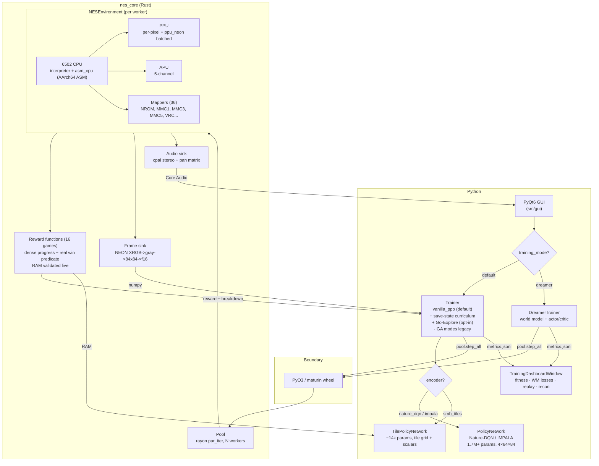
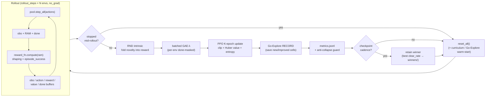
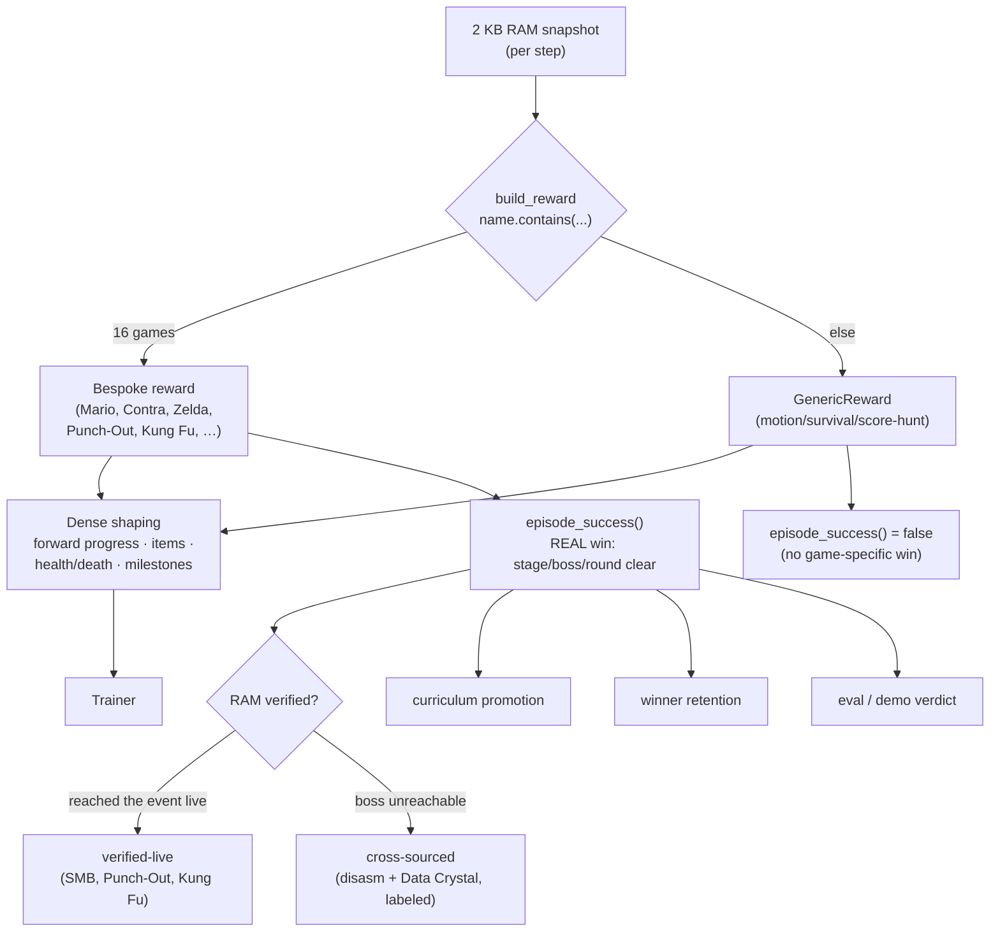

# Neural Entertainment System

A macOS / Apple-Silicon NES emulator that trains AI to play NES games. A
purpose-built Rust NES core (`nes_core`) drives a PyTorch + PyQt6 reinforcement-
learning stack: you supply a ROM, run one command, and watch a policy learn to
play — reproducibly.

Hereafter, **NES** refers to this project (Neural Entertainment System); the
original 1985 console is referred to by its full name to disambiguate.

## Where it stands today


*A trained reinforcement-learning policy playing Super Mario Bros from
power-on — 1-1 through the 1-4 castle, no warp pipes. This is the network
choosing every button press live; it is **not** a replay of a recorded run.*

**How far we've come.** A genuinely learned agent clears all of **World 1**
(1-1, 1-2, 1-3, and 1-4 including Bowser's castle) in one continuous session
from the title screen, then reaches 2-1. Reproduce this exact recording:

```bash
python scripts/record_learned_playthrough.py \
  --manifest configs/composite_learned.yaml \
  --out runs/demo/world1 --stop-after-worlds 1
# -> World 1 cleared, no warps, end_reason: seq_clear
```

**How much is left — stated plainly, because an honest miss beats a dishonest
highlight reel:**

- **Not the whole game.** It beats World 1, then gets stuck at the 2-1
  hand-off. Worlds 2–8 are open work.
- **Not perturbation-proof.** Under the research-standard sticky-actions
  protocol (25% random input repeats, Machado et al. 2018), the honest
  cold-start score is **0/50** today — the policy is a start-locked trajectory
  that stochastic play breaks. Making it robust is the active work.
- **Not yet one agent that understands the game — this is the real gap.**
  Today's playthrough is a *hierarchical composite*: a separate learned net per
  level, swapped in by a router that reads the on-screen world/level. No single
  policy experiences a whole run, so nothing yet *recognizes* "I've entered a
  water level" or "this is a castle" and adapts its navigation. Per-level
  specialists, hand-shaped per-level rewards, and save-state warm-starts each
  quietly removed the pressure to learn the game's fundamentals. The next
  direction is **one generalist policy, trained across all levels with a
  generic reward, that learns environment types — overworld, water, castle,
  pipe-descent — and navigates each on its own.** That is the *un-solved*
  version of this benchmark, and where the real contribution lives.

The Rust emulator and the honest-evaluation harness underneath are the mature
layers (below); the single generalist agent is the expedition ahead.

## What this is

- A Rust NES core — 6502 CPU, PPU, APU, and 36 mappers. The **pure-Rust
  interpreter is the correctness reference** and what gates fidelity:
  **nestest** validates 8,991 CPU instructions byte-for-byte — registers *and*
  cycle count (CYC) — against the Nintendulator golden trace, and a **31-ROM
  Mesen-oracle lockstep** plus **146 parity tapes** (`make parity`) diff
  `nes_core` against Mesen / nes-py frame-by-frame. A hand-written
  **AArch64-assembly 6502 core** (`nes_core/src/cpu_asm.s`) rides on top as an
  Apple-Silicon *performance* path — enabled in the maturin/Makefile build,
  differential-fuzzed against the interpreter for 240M+ instructions with zero
  divergence, and falling back to the interpreter for any unported opcode. (The
  full public blargg CPU/PPU/APU test-ROM gauntlet is **not yet run** end-to-end
  — see *Accuracy status* below.)
- Broad compatibility: as of the latest library scan, **793 of 794 tested ROMs
  (~99.9%)** boot cleanly across **36 mappers**. Unsupported mappers and
  malformed headers fail cleanly at load time with a `RuntimeError` instead of
  crashing the trainer.
- A reinforcement-learning trainer that runs many NES instances in parallel
  through a zero-IPC rayon worker pool, learns a policy with PPO, and lets you
  watch it live in a PyQt6 GUI or reproduce a result headless from the command
  line.

Everything the trainer touches per step — emulation, reward, frame preprocess,
depth tracking — lives on the Rust side behind a single PyO3 call. The Python
side owns PyTorch (MPS) inference and the GUI.

## Screenshots


*Main control window — ROM selector, training start/stop, curriculum stage,
behavior-cloning warm-start picker.*


*Live frame grid for all worker NES instances during training. Each tile is a
separate reinforcement-learning environment running in parallel through the
rayon worker pool.*


*Per-iteration metrics: best/average fitness, success rate, and the per-step
timing breakdown (emulation / forward pass / inference / bookkeeping).*

## Requirements

- macOS on Apple Silicon (M1/M2/M3/M4). Portable fallbacks compile but are not
  the primary target.
- **Python 3.11** (`brew install python@3.11`).
- Rust toolchain (`rustup`) and the Xcode Command Line Tools — the installer
  checks for both and tells you how to get them.
- Your own legally-owned NES ROMs. **None are distributed with this project.**

## Install

```bash
git clone <your-fork-url>
cd macos-emulation-and-training

# Creates .venv, installs Python deps, builds the Rust nes_core wheel via
# maturin, and (if ROMs are present) applies PGO for ~81% more throughput.
bash scripts/install_macos.sh

source .venv/bin/activate
```

The installer verifies the PyTorch **MPS** backend and the `nes_core` import
before finishing. To exercise the Python stack without supplying any ROM, run
the test suite:

```bash
make test
```

If you only want to (re)build the Rust core:

```bash
make build            # release build, features "python,asm_cpu"
make build-pgo        # + 3-stage instrument -> profile -> rebuild (~3 min)
```

Build features worth knowing:
- `python` — PyO3 module + cpal audio (set by maturin).
- `asm_cpu` — AArch64-assembly 6502 core: an Apple-Silicon *performance* path
  (on in the maturin/Makefile build; the pure-Rust interpreter remains the
  fidelity reference and is what `cargo test` exercises).
- `simd` — NEON palette and audio paths.
- `metal` — experimental Metal compute shim (off by default; see docs).

## Train a game

The end-to-end loop is: **supply a ROM → capture a start state → train → eval →
watch.** Everything below uses commands that exist in the `Makefile` and
`scripts/`. Run `make setup-check` first — it verifies your environment (venv,
`nes_core`, torch MPS) and lists exactly which per-game ROMs are present or
missing under their expected filenames. Once a ROM is in place,
`make setup-game GAME=<name>` validates it by MD5 and captures its start state
in one step (combining steps 1–2 below).

### 1. Supply the ROM

Drop your legally-owned ROM into `roms/` under the canonical filename the
launcher expects (`roms/` is gitignored — nothing you put there is ever
committed or shipped):

| game | `--game` | expected ROM path |
|------|----------|-------------------|
| Super Mario Bros. | `mario` | `roms/Super Mario Bros. (World).nes` |
| Contra | `contra` | `roms/Contra (USA).nes` |
| Mega Man 2 | `megaman` | `roms/Mega Man 2 (USA).nes` |
| Castlevania | `castlevania` | `roms/Castlevania (USA).nes` |
| The Legend of Zelda | `zelda` | `roms/Legend of Zelda, The (USA) (Rev A).nes` |
| Metroid | `metroid` | `roms/Metroid (USA).nes` |

(Point at any file with `--rom /path/to/rom.nes` if your filename differs.)

### 2. Capture a start state

Without a start state, the emulator cold-boots to the **title screen**, where
the attract-mode demo auto-plays and ignores controller input — training there
gives zero learning signal. This one-time step boots the ROM, mashes through the
menus, and snapshots the moment the player becomes controllable, writing
`roms/<rom_stem>_start.state.bin` (the sidecar the launcher and profiles use):

```bash
python scripts/capture_start_state.py --game mario
```

### 3. Train

```bash
make train GAME=mario
```

This runs `scripts/train_game.py` headless with the game's default profile —
for Mario that is `configs/mario_vanilla_ppo.yaml`, the **vanilla PPO** recipe
(single shared policy, N parallel environments as rollout collectors, batched
GAE, K-epoch PPO update). It auto-resumes from the latest checkpoint by default;
pass `--no-resume` through the script for a fresh run.

Per-game checkpoints land in `checkpoints/<game_slug>/` (for Mario,
`checkpoints/super_mario_bros/`) as `vanilla_ppo_iter_NNNNN.pt`, written every 10
iterations. What you will see on stdout, roughly:

```
[launcher] profile=mario_vanilla_ppo.yaml game=Super Mario Bros. num_envs=60 iters=10000 resume=True
[launcher] checkpoint_dir = checkpoints/super_mario_bros
iter 12 | ppo loss=0.031 policy=-0.004 value=0.048 entropy=1.71 | rnd=0.92
  max-W-L: 1-1=41  |  end-W-L: 1-1=41  |  curriculum stage=0 (anchor area=0, 0/60 envs past stage)
...
```

The curriculum line is the one to watch on Mario: as the pool learns to clear a
level it snapshots the worker state at the new stage boundary and warm-starts
all envs from it, so `curriculum stage` climbs 0 → 1 → 2 as it advances through
1-1 → 1-2 → 1-3 in training. (These are training-time clears; the honest
cold-start sticky eval is a separate, lower number — see *What actually works
today*.) Stages persist to `checkpoints/super_mario_bros/smb_curriculum/` so
restarts resume mid-curriculum.

Want to watch it train live instead of headless? Launch the GUI, pick the ROM,
and hit start:

```bash
python -m src.gui.main
```

### 4. Reproduce a win (eval)

```bash
make eval GAME=mario
```

Loads the best **retained winner** (`checkpoints/<game_slug>/winners/best.pt` —
the highest-clear-rate policy the run ever produced, kept even if training later
self-collapses), falling back to the best-eval-scoring checkpoint and then the
latest. It runs greedy (argmax) episodes and prints a JSON summary — clear rate,
furthest stage reached (`mean_max_byte`), mean return and length — appending a
row to `checkpoints/<game_slug>/eval.jsonl`. By default it boots from the
profile start state and measures the first stage; to score a later curriculum
stage, run the script directly:

```bash
python scripts/eval_game.py --game mario --stage 2 --episodes 30
```

For a bird's-eye view across every game you've trained:

```bash
make scoreboard
```

### 5. Watch it win

```bash
make demo GAME=mario
```

Plays back the retained winner as a short GIF under `checkpoints/<game_slug>/`,
so the flagship "watch it win" moment shows a real clear — not whatever the
latest (possibly self-collapsed) checkpoint happens to be. `--latest` forces the
freshest checkpoint and `--iter N` pins an exact one.

For a bit-for-bit reproducible run, pass `--seed` to the launcher
(`python scripts/train_game.py --game mario --seed 0`); the seed and the ROM's
whole-file MD5 are recorded in `checkpoints/<game_slug>/run_manifest.json`.

## What actually works today

Honest, evidence-based status, split by the two ledgers defined in `CLAIMS.md`:
**LEARNED** (a policy trained by RL, evaluated cold from power-on under the
Machado et al. 2018 sticky-actions protocol) versus **EXHIBITION** (search
output — Go-Explore / routed-replay / BC-pilot solutions, always labeled as the
*search system* solving the game, never as learning). This repo ships the
**emulator, the trainer, and the harnesses** — it does not ship pre-trained
checkpoints (they are gitignored; you train them with the flow above).

- **Super Mario Bros. — LEARNED, honest cold-start number: `0/50`.** Under the
  only headline protocol (cold power-on, zero test-time state loads,
  sticky-actions 0.25 + start-jitter, single-life, 50 episodes × 2 seeds), the
  best policy to date **scores 0/50 — it dies in 1-1.** The *deterministic*
  (no-sticky) greedy eval of the same checkpoint does reach the 1-1 flag (1.0),
  and learned per-level calibration peaked around ~0.11 before collapsing — but
  per the claims policy the sticky number is the one that counts, and right now
  it is zero. Backward-algorithm Go-Explore robustification (the published
  Nature-2021 cure for exactly this sticky collapse) is the active work.
- **Super Mario Bros. — EXHIBITION (search, not learning).** A level-keyed
  composite (`eval_composite`) chains routed BC-pilot / Go-Explore solutions
  into a **cold full-World-1 single-life traversal (`seq_clear_rate 1.0`)**, and
  a Go-Explore search crosses **1-4 → world 2** (beats Bowser, touches the axe)
  reliably from a mid-1-4 save-state, with the win predicate verified live on
  real clears. These are deterministic replays of search output — real and
  interesting, but the *search system* solving the game, **not** a
  learned-from-power-on policy. Greedy training telemetry also shows 1-1/1-2/1-3
  clears mid-run; those are training-time numbers, not the honest sticky eval
  above. Full autonomous progression to 8-4 remains a research goal.
- **16 games have hand-authored reward functions with real win predicates** —
  Mario, Contra, Castlevania, Mega Man, Metroid, Zelda, Tetris, Bubble Bobble,
  Punch-Out, Kung Fu, Gradius, Excitebike, Ghosts'n Goblins, DuckTales, Kid
  Icarus, Double Dragon. Every reward's RAM addresses are validated against the
  live emulator (drive the game, diff RAM); `episode_success()` is a genuine
  win (stage/match/floor/round clear or game beaten), never a "positive
  cumulative reward" proxy. **Win RAM verified live** (reached the event on the
  emulator) for SMB, Punch-Out, and Kung Fu; the rest key on reachable RAM with
  the final-boss values cross-sourced (labeled in-code) until an agent or a
  near-boss save-state reaches those endgames. **These make the games trainable
  and measurable — no game yet has a LEARNED cold-start clear (SMB world 1's
  demonstrated clear is EXHIBITION — search / routed replay, per above); winning
  them for real is a matter of training compute plus the sticky-robustness work,
  not missing code.**
- **DreamerV3 world-model trainer — scaffolded and trains end-to-end**, but has
  not been converged to outperform PPO on these games; it is a research path,
  not a shipping result.

The emulator itself is the mature layer: byte-exact CPU (nestest, registers +
CYC), 146 parity tapes green, a 31-ROM Mesen-oracle lockstep, ~99.9% library
boot compatibility, and a differential fuzz of the ASM core against the
pure-Rust reference with zero divergence over 240M+ instructions. Recent
fidelity fixes (MMC5/MMC1-SUROM/MMC3 banking, PPU forced-blank backdrop +
color-emphasis, OAM-DMA bus routing) were validated against Mesen as the
ground-truth oracle, and the whole change set was put through an adversarial
regression review.

**Accuracy status (the honest gap).** What *passes today*: nestest byte-exact
including cycle count (CYC), the 31-ROM Mesen-oracle lockstep
(`tests/parity/test_mesen_lockstep.py`), and the 146 parity tapes (`make
parity`). What is **not** yet done: the full public **blargg CPU/PPU/APU
test-ROM gauntlet** has not been run end-to-end as a gate. Individual blargg
ROMs have been read during fidelity work, but "passes the blargg suite" is not
a claim this project has earned suite-wide — running that gauntlet is open work,
not a shipped result.

### Game readiness

| Game | Reward + win predicate | Start state | Win RAM |
|---|---|---|---|
| Super Mario Bros. | ✅ flagpole + castle (world-byte) | ✅ | **verified-live** |
| Punch-Out!! | ✅ match-id KO/TKO latch | ✅ | **verified-live** |
| Kung Fu | ✅ floor-clear + Sylvia | ✅ | **verified-live** |
| Contra | ✅ per-stage clear ($0030/$003B) | ✅ | cross-sourced |
| Castlevania | ✅ Dracula (final block) | ✅ | cross-sourced |
| Metroid | ✅ Mother Brain + escape | ✅ | reachable RAM |
| Zelda | ✅ Ganon / ending song | ✅ | reachable RAM |
| Mega Man (2) | ✅ shaping (no all-Masters flag) | ✅ | n/a (no game-win flag) |
| Tetris / Bubble Bobble | ✅ line-goal / round-clear | ⚠ capture | cross-sourced |
| Gradius / Excitebike / Ghosts'n Goblins / DuckTales / Kid Icarus | ✅ stage/track/level clear | ✅ | live-validated addrs |
| Double Dragon | ✅ mission-clear | ⚠ capture | cross-sourced |

## Architecture



**Trainer modes.** `vanilla_ppo` is the default and the recommended recipe: one
shared policy, N parallel envs as rollout collectors, batched GAE, K-epoch PPO.
The older **GA-based modes** (`ga_ppo`, `pure_ppo`) — PPO on top of a genetic
algorithm with a population of policies — are **legacy**: a two-day
investigation found that folding data from many distinct policies into one PPO
gradient violates PPO's stable-policy assumption and never produced a committed
clear. They remain selectable via `reinforce.trainer_mode` for comparison.

### Training loop (vanilla_ppo)

One shared policy; N parallel NES envs are rollout collectors. Two optional,
mutually-exclusive exploration aids sit on top: the **SMB save-state
curriculum** (warm-start the pool at progressively later captured states) and
**Go-Explore** (archive the furthest-reached cells as save-states, return to the
frontier, then explore onward — the lever that cracked the SMB 1-4 Bowser fight).



### Reward and win-predicate flow

Every game's reward reads the worker's RAM snapshot and emits (a) dense shaping
that must be dominated by (b) a **real `episode_success()` win predicate** on
validated RAM — never a "positive cumulative reward" proxy. `episode_success`
feeds curriculum promotion, winner retention, and the eval/demo "did it win?"
verdict, so a wrong predicate silently corrupts all three (the bug class this
project hunts).



## Performance

Measured on an M4 Max MacBook Pro against nes-py (LaiNES C++) on Contra. Your
numbers will vary with chip, macOS version, and background load.

- `fs=1` single-env, full render: **0.72–0.75×** nes-py. LaiNES still wins this
  workload; the per-pixel bandwidth gap is the last open lever.
- `fs=4` single-env: **1.23–1.25×** nes-py. Beats parity.
- `fs=4` 12-parallel (training workload): up to **3.72×** nes-py.
- `fs=16` 12-parallel (aggressive RL cadence): up to **3.58×** nes-py.

Parallel training throughput is the headline number and the workload the trainer
actually runs. Reproduce with `make bench-scaling` / `make bench-hot`.

**Save/restore latency** (full 21,164-byte `nes::State` blob; benched in
`runs/emulator_bench_2026-07-20.json` via `scripts/bench_save_restore.py`):
**median save ~1.8 µs / restore ~1.0 µs, p99 save ~4.7 µs / restore ~1.3 µs** at
one worker, and it holds at 16-worker scale (**p99 save ~4.7 µs, restore
~2.1 µs**) — so "microsecond save/restore at scale" is now measured, not
asserted. Honest caveat: that run was under a concurrent ~11-core training load,
and the *mean* is inflated by rare OS-preemption outliers (a few multi-ms tail
events), so the median/p99 above — not the mean — describe the common case.

## Compatibility

The full matrix lives in `reports/full_library.md`. A summary:

- **36 mappers** implemented, covering **~99.9%** of the tested 794-ROM library.
  Every supported mapper passes at 100% on its carts.
- Discrete logic: NROM (0), UxROM (2), CNROM (3), AxROM (7), Colordreams (11,
  66), CPROM (13), BNROM / NINA-001 (34), Caltron 6-in-1 (41), NINA-06 / HES
  (113), Action 52 (228), Camerica Quattro (232), Maxi 15 (234), Camerica
  BF9093 (71), Nina-03 / NAMCOT-00301 (79).
- MMC family: MMC1 / SxROM (1), MMC3 / TxROM (4), MMC5 / ExROM (5), PxROM / MMC2
  (9), MMC4 / FxROM (10), TxSROM (118), TQROM (119), NWC 1990 (105), NES-ZZ
  multicart (37), NES-QJ multicart (47).
- Konami VRC: VRC2a (22), VRC2b (23), VRC4 (21, 25), VRC6 (24, 26), VRC7 (85).
- Namco + Sunsoft + Tengen: N163 (19), Sunsoft-4 (68), FME-7 (69), Tengen
  RAMBO-1 (64).
- Unsupported mappers and malformed headers raise a clean `RuntimeError` at load
  time. Check programmatically with `nes_core.supported_mappers()`.

## Features

**Emulator core**
- Full Rust NES core: 6502 CPU, PPU, APU, 36 mappers, versioned save state
  (`NCST\x01` magic).
- AArch64 assembly 6502 core behind `asm_cpu`. 99.97% hit rate on real ROMs;
  falls back to the pure-Rust core for unported opcodes.
- Batched PPU via NEON SIMD with mid-scanline fallback for state changes the
  batched path cannot capture.
- Rayon-based in-process worker pool. No IPC, no shared memory, no pickling.
- PGO build pipeline (`scripts/pgo_build.sh`) with 3-stage instrument → profile
  → rebuild.
- macOS-native audio via cpal. 5-channel pan matrix, per-channel resampler
  (43653 Hz → 44100 Hz).

**Training stack**
- **Vanilla PPO (default).** Single shared policy, N parallel envs, batched
  GAE, K-epoch update — the literature recipe that empirically clears SMB 1-1.
- **Save-state curriculum** (SMB): auto-snapshots the pool when it reaches a new
  level and warm-starts every env from it, advancing stage by stage.
- **Two policy architectures** dispatched by `reinforce.encoder`:
  - **Nature-DQN CNN** or **IMPALA ResNet** on stacked pixels. Universal — works
    on any ROM with no per-game code. ~1.7M–3.4M params.
  - **Tile-based MLP** (SMB) — reads RAM directly into a 13×13 semantic tile
    grid + scalars. ~14k params. Shrinks the search space ~120× so PPO
    gradients can actually steer the policy.
- **Dense reward shaping** for SMB — RAM-readable progress checkpoints fire
  bonuses at each major obstacle, giving PPO intermediate signal instead of one
  sparse flag reward.
- **Auxiliary losses & exploration helpers**: RND intrinsic motivation, DrQ
  random-shift augmentation (pixel mode), symlog reward transform, optional
  elite-diversity preservation.
- **DreamerV3 world-model trainer** as an alternative (`training_mode: dreamer`)
  — categorical 32×32 latent RSSM, decoder reconstruction, λ-returns on imagined
  rollouts, Polyak-EMA target critic, atomic checkpointing with auto-resume.
- **Legacy GA modes** (`ga_ppo`, `pure_ppo`) — PPO on a genetic algorithm with
  behavior-cloning warm start; kept for comparison, not the recommended path.
- **PyTorch MPS** policy training. **Core ML export** for elite genomes; ANE
  inference in replay (~8× faster than MPS at batch 1).

**Observability**
- **TrainingDashboardWindow** — single-pane observer view: best/avg fitness,
  reward signal stack, PPO learning telemetry, world-model losses, depth +
  curriculum success, replay-buffer fill, depth records, highlight clips, and a
  live world-model reconstruction strip (original vs. decoded frames).
- **Live frame grid** for all N workers, **reward-tuning sliders**, an **audio
  mixer** with per-worker solo, **replay and play windows**, and an
  **auto-clip highlight recorder** that flushes the last 4 seconds of any worker
  that triggers a banner event to `highlights/*.mp4`.

## Testing and validation

```bash
make test        # pytest suite (tests/, 120s timeout) — no ROM needed
make selftest    # GUI widget construction, headless (offscreen Qt)
make parity      # 146 nes_core-vs-nes-py/Mesen diff tapes (< 2 min)

# Rust (includes nestest CPU validation: 8,991 instructions byte-exact)
cd nes_core && cargo test --all-features

# Library-wide sweeps (~3 min each; require ROMs in roms/)
python scripts/playability_sweep.py    # boots but doesn't progress
python scripts/parity_sweep.py         # RAM divergence vs nes-py
```

Five validation layers, each catching a different class of bug — see
`docs/ARCHITECTURE.md#validation-harnesses` for the pyramid. In short:
**nestest** is the CPU spec gate; the **byte-exact ROM fleet** is the strictest
end-to-end test; the **playability sweep** catches games that boot but don't
progress (the layer that surfaced both the Bill & Ted's and Zelda boot bugs).

Differential fuzz status: the AArch64 ASM core has been diffed against the
pure-Rust reference across 240M+ randomized instructions with **0 divergences**
in A/X/Y/SP/P/PC or the 2 KB RAM FNV-1a hash. See `nes_core/SECURITY.md` for the
latest soak numbers.

## Limitations and roadmap

What this release **does** ship:

- A fast Rust NES emulator with 36 mappers (793/794 ROMs boot), byte-exact CPU
  validation via nestest (8,991 instructions, registers + cycle count) and a
  31-ROM Mesen-oracle lockstep, plus an AArch64 ASM 6502 core
  (differential-fuzzed against the pure-Rust interpreter for 240M+ instructions,
  zero divergence).
- The training stack: rayon worker pool, vanilla-PPO trainer (default) with
  save-state curriculum, tile and pixel-CNN encoders, RND exploration, a
  DreamerV3 scaffold, and Core ML export.
- Validation gated by `make parity` (146 tapes) and the nestest CPU harness.

What this release **does not** ship:

- **Pre-trained checkpoints.** Checkpoints are gitignored; train them yourself
  with the flow above. On SMB, world-1 training produces deterministic greedy
  clears of 1-1/1-2/1-3 (training-time / no-sticky numbers), but the honest
  cold-start sticky eval is currently **0/50**; **1-4 and full autonomous 8-4
  are not yet solved**, and the World-1 traversal that does exist is EXHIBITION
  (search / routed replay), not a learned policy — see *What actually works
  today*.
- **A clearing Contra policy.** Contra learns under the pixel-CNN + RND recipe
  but does not yet clear stage 1; value-loss tuning is the open lever.
- **Tile encoders for games other than SMB.** The framework
  (`src/emulation/tile_observations/`) is generic; each new game needs a per-game
  RAM decoder (~1 day of NESdev-wiki reading). The other games train on the
  universal pixel-CNN path meanwhile.
- **A converged DreamerV3 policy.** The world-model scaffold trains end-to-end
  but has not been converged to beat PPO on these games — open research.
- **All 794 tested ROMs booting.** The single load failure (`Yoshi (USA).nes`)
  is a truncated dump, not an emulator bug.
- **A completed public accuracy gauntlet.** nestest (registers + CYC), the
  31-ROM Mesen-oracle lockstep, and the 146 parity tapes pass; the full public
  **blargg CPU/PPU/APU test-ROM suite** has not yet been run end-to-end as a
  gate (see *Accuracy status*).
- **USB-DAC audio sign-off.** Done on built-in MacBook speakers and headphones;
  run `scripts/audio_signoff.py` for the 60-second harness on your own devices.
- **Metal-accelerated PPU rendering.** A v1 palette-expand kernel exists
  (`nes_core/src/metal_render.rs`) but Metal dispatch overhead dwarfs the
  per-frame compute at this workload size. A batched-across-workers v2 is open
  research.

Near-term roadmap:

- Push SMB past 1-3: solve 1-4 and stitch full autonomous world progression.
- Tune Contra's value loss to a first stage-1 clear.
- Tile encoders for the other five games (each ~1 day of work).
- Tune DreamerV3 for sparse-reward games (Zelda, Metroid).
- Close the `fs=1` single-env perf gap with LaiNES (currently ~0.7×).

This is **pre-release** software. Expect the README and docs to be revised as
each batch lands.

## Directory layout

```
.
├── nes_core/          Rust NES core crate (maturin wheel)
│   ├── src/             CPU, PPU, APU, mappers, pool, pyo3 bindings
│   ├── benches/         cargo-bench harnesses
│   ├── examples/        asm_diff_fuzz, etc.
│   ├── tests/           Rust integration tests
│   └── SECURITY.md      unsafe audit + FFI boundary notes
├── src/               Python trainer + GUI
│   ├── emulation/       rust_pool_adapter, frame_utils
│   │   └── tile_observations/   per-game RAM-tile decoders (smb.py)
│   ├── training/        Trainer, DreamerTrainer, curriculum, GA (legacy), BC,
│   │                    narrator, depth, replay_buffer
│   ├── gui/             PyQt6 windows (main, grid, training_dashboard,
│   │                    replay, mixer, ...)
│   ├── models/          PolicyNetwork (CNN), TilePolicyNetwork (MLP),
│   │                    WorldModel (Dreamer), DreamerActor/Critic, RND,
│   │                    Core ML export
│   ├── audio/           Thin façade over nes_core.AudioMixer
│   └── utils/           Reward factory (dispatches to nes_core)
├── configs/           Per-game profiles. mario_vanilla_ppo.yaml is the
│                      launcher default for Mario; mario_tiles.yaml and
│                      mario.yaml are alternate profiles.
├── docs/              Architecture + proposals
├── scripts/           install, capture_start_state, train_game, eval_game,
│                      scoreboard, pgo_build, benches
├── tests/             pytest suites
├── reports/           Compatibility scan output
└── roms/              User-supplied .nes files (gitignored)
```

## License

MIT — see `LICENSE`. The Rust crate is dual-licensed under MIT or Apache-2.0
(`nes_core/LICENSE-MIT`, `nes_core/LICENSE-APACHE`) because upstream mapper code
was forked under that scheme.

You must supply your own NES ROMs. None are distributed with this project. Use
only ROMs you legally own.

## Acknowledgements

This project builds on the work of several open-source NES emulators. None of
their code ships in this repo, but the lineage is real and worth naming.

- [**RustedNES**](https://github.com/PhilipK/RustedNES) (MIT/Apache-2.0) — the
  starting point for the pure-Rust core. Several mappers (MMC3, MMC5, MMC2) and
  the VRC6 audio channel were forked and then heavily reworked: cycle timing
  tightened to match Mesen, save-state versioning added, and the per-pixel PPU
  rewritten so the AArch64 ASM CPU and NEON batched PPU could share a hot path.
  The dual MIT-or-Apache-2.0 licensing on `nes_core/` is carried over from this
  lineage.
- [**LaiNES**](https://github.com/AndreaOrru/LaiNES) (GPL-3.0) — the C++
  emulator that backs `nes-py`. Used strictly as a structural and behavioral
  reference: when our CPU diverged from the canonical 6502 trace, LaiNES was
  read alongside the NESdev wiki to figure out which side was wrong. The
  cycle-locked `advance_one_frame` loop and the abs-mode MMIO early-commit
  semantics were both informed by reading LaiNES. No LaiNES code is present in
  this repo.
- [**nes-py**](https://github.com/Kautenja/nes-py) (MIT) — the Python wheel
  wrapping LaiNES. Used as the throughput bake-off baseline for every perf
  commit (`scripts/bench_vs_nes_py.py`) and as the diff oracle for the parity
  tapes.
  Legacy bake-off deps live in `requirements-legacy-bakeoff.txt`; nes-py is not
  on the runtime path.
- [**Mesen**](https://www.mesen.ca/) (GPL-3.0) — used as the ground-truth oracle
  for fidelity work. The Lua test-runner mode (`Mesen --testRunner`) drives a
  31-ROM diff harness (`tests/parity/test_mesen_lockstep.py`,
  `scripts/tracing/mesen_*.lua`) that catches CPU/RAM/PPU divergence. Several
  real bugs (PPU $2002 reset value, MMC1 RMW consecutive-write filter, NES 2.0
  PRG-RAM nibble parsing) were found by diffing against Mesen traces. No Mesen
  code is present in this repo.
- [**NESdev Wiki**](https://www.nesdev.org/wiki/) — indispensable reference for
  every mapper, PPU state-machine quirk, and APU oddity in this codebase.
- **blargg's NES test ROMs** — the standard public CPU/PPU/APU accuracy
  gauntlet. Individual ROMs were read during fidelity work; the full suite is
  not yet run end-to-end as a gate (see *Accuracy status*). nestest and the
  Mesen-oracle lockstep are the current CPU gates.
- **kevtris's nestest** + the **Nintendulator golden trace** — drive the
  byte-exact CPU validation harness (8,991 instructions, every official +
  undocumented opcode). These are the only third-party ROMs distributed with the
  project (`roms/.test_roms/`, public domain).
