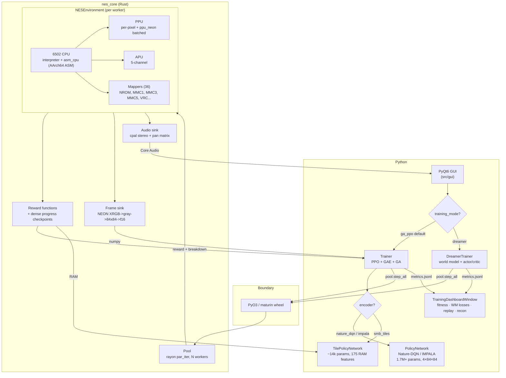

# Neural Entertainment System

A NES that runs NES — reinforcement-learning policy training on Nintendo
Entertainment System games, powered by a purpose-built Rust NES emulator
with a hand-written **AArch64 assembly 6502 core for Apple Silicon**.

Hereafter, **NES** refers to this project (Neural Entertainment System);
the original 1985 console is referred to by its full name to disambiguate.

## Overview

This repository pairs a hand-written Rust NES emulator (`nes_core`) with a
PyTorch + PyQt6 training framework. The emulator handles the 6502 CPU, PPU,
APU, and mapper surface in-process; the trainer runs PPO + GAE on top of a
genetic algorithm, with optional behavior cloning warm starts. Everything the
trainer hits per step — emulation, reward computation, frame preprocess,
narrator, depth tracker — lives on the Rust side behind a single PyO3 call.

What sets it apart:

- **Hand-written AArch64 assembly 6502 core** (`nes_core/src/cpu_asm.s`,
  ~4,300 lines) covering 151 official + ~30 stable illegal opcodes. Hits
  99.97% of dispatched instructions on real ROMs and falls back to the
  pure-Rust interpreter for the rest. This is the per-step CPU on Apple
  Silicon — not a side experiment.
- **NEON-SIMD batched PPU path** for sprite eval, background fetch, and
  XRGB → grayscale → 84×84 frame preprocess.
- **Zero-IPC rayon worker pool** that steps every NES instance in a single
  PyO3 call. No pickling, no shared memory, no subprocesses.
- **PGO build pipeline** (`scripts/pgo_build.sh`) that lifts hot-path
  throughput ~81% on an M4 Max via 3-stage instrument → profile → rebuild.
- **macOS-native audio** via cpal with a 5-channel pan matrix and a
  per-channel 43653 → 44100 Hz resampler.

The Python side owns PyTorch MPS inference and the PyQt6 GUI; the Rust side
owns every per-step op.

As of the latest library scan, **793 of 794 tested ROMs (99.9%)** boot cleanly
across **36 supported mappers**. The single miss is a ROM with a truncated dump
(iNES header claims more bytes than the file contains). Unsupported mappers
fail at load time with a `RuntimeError` rather than crashing the trainer. See
`reports/full_library.md` for the matrix.

## Screenshots


*Main control window — ROM selector, training start/stop, depth-driven
curriculum stage, behavior-cloning warm-start picker.*


*Live frame grid for all 16 worker NES instances during training. Each tile
is a separate reinforcement-learning environment running in parallel through
the rayon worker pool.*


*Per-generation metrics: best fitness, average fitness, success rate, and
the per-step timing breakdown (emulation / forward pass / inference /
bookkeeping).*

## Architecture



## Performance

Measured on an M4 Max MacBook Pro against nes-py (LaiNES C++) on Contra,
2026-04-21. Your numbers will vary with chip, macOS version, and background
load.

- `fs=1` single-env, full render: **0.72 to 0.75x** nes-py. LaiNES still
  wins this workload; the per-pixel bandwidth gap is the last open lever and
  is tracked in the v3 plan.
- `fs=4` single-env: **1.23 to 1.25x** nes-py. Beats parity.
- `fs=4` 12-parallel (training workload): up to **3.72x** nes-py.
- `fs=16` 12-parallel (aggressive RL cadence): up to **3.58x** nes-py.

Parallel training throughput is the headline number and the workload the
trainer runs.

## Quick start

This repo targets macOS on Apple Silicon. Portable fallbacks compile but are
not the primary target.

```bash
# 1. Clone
git clone <your-fork-url>
cd macos-emulation-and-training

# 2. Install (creates .venv, installs deps, builds the Rust wheel via
#    maturin, optionally applies PGO for ~81% more throughput)
bash scripts/install_macos.sh

# 3. Activate the venv
source .venv/bin/activate

# 4. One-generation smoke test
python scripts/test_trainer_one_gen.py

# 5. Launch the GUI
python -m src.gui.main
```

If you prefer a manual build of just the Rust wheel:

```bash
cd nes_core
maturin develop --release --features "python,asm_cpu"
```

Features to know:
- `python` — enables the PyO3 module and cpal audio. Set by maturin.
- `asm_cpu` — AArch64 assembly 6502 core. Recommended on Apple Silicon.
- `metal` — Metal compute shim (disabled by default; see docs).
- `simd` — NEON/SSE palette and audio paths.

## Compatibility

The compatibility matrix lives in `reports/full_library.md`. A summary:

- **36 mappers** implemented, covering **99.9%** of the tested 794-ROM
  library. Every supported mapper passes at 100% on its carts.
- Discrete logic: NROM (0), UxROM (2), CNROM (3), AxROM (7), Colordreams (11,
  66), CPROM (13), BNROM / NINA-001 (34), Caltron 6-in-1 (41), NINA-06 /
  HES (113), Action 52 (228), Camerica Quattro (232), Maxi 15 (234),
  Camerica BF9093 (71), Nina-03 / NAMCOT-00301 (79).
- MMC family: MMC1 / SxROM (1), MMC3 / TxROM (4), MMC5 / ExROM (5),
  PxROM / MMC2 (9), MMC4 / FxROM (10), TxSROM (118), TQROM (119),
  NWC 1990 (105), NES-ZZ multicart (37), NES-QJ multicart (47).
- Konami VRC: VRC2a (22), VRC2b (23), VRC4 (21, 25), VRC6 (24, 26),
  VRC7 (85).
- Namco + Sunsoft + Tengen: N163 (19), Sunsoft-4 (68), FME-7 (69),
  Tengen RAMBO-1 (64).
- Unsupported mappers and malformed headers raise a clean `RuntimeError` at
  load time. The trainer never crashes from a bad ROM. Use
  `nes_core.supported_mappers()` from Python to check programmatically.

## Features

**Emulator core**
- Full Rust NES core: 6502 CPU, PPU, APU, 36 mappers, versioned save state
  (`NCST\x01` magic).
- AArch64 assembly 6502 core behind `asm_cpu`. 99.97% hit rate on real ROMs;
  falls back to the pure-Rust core for unported opcodes.
- Batched PPU via NEON SIMD with mid-scanline fallback for state changes the
  batched path cannot capture.
- Rayon-based in-process worker pool. No IPC, no shared memory, no pickling.
- PGO build pipeline (`scripts/pgo_build.sh`) with 3-stage instrument →
  profile → rebuild.
- macOS-native audio via cpal. 5-channel pan matrix, per-channel resampler
  (43653 Hz → 44100 Hz).

**Training stack**
- **PPO + GAE on top of a genetic algorithm** with optional behavior cloning
  warm start, depth-driven curriculum, and stale-best restart.
- **DreamerV3 world-model trainer** as an alternative to PPO+GA (selectable
  per-profile or via the GUI dropdown). Categorical 32×32 latent, RSSM with
  GRU + posterior/prior heads, decoder-based reconstruction, λ-returns on
  imagined rollouts, Polyak-EMA target critic, atomic checkpointing with
  auto-resume.
- **Two policy architectures** dispatched by `reinforce.encoder`:
  - **Nature-DQN CNN** (default) or **IMPALA ResNet** on stacked pixels.
    Universal — works on any ROM with no per-game code. ~1.7M–3.4M params.
  - **Tile-based MLP** (currently SMB only). Reads RAM directly into a
    13×13 semantic tile grid + scalars. ~14k params. The MarI/O recipe
    modernized — search space shrinks ~120× so PPO gradients become large
    enough to actually steer the policy.
- **Dense reward shaping** for SMB. RAM-readable progress checkpoints fire
  bonuses at every major obstacle through 1-1, giving PPO non-trivial
  intermediate signal instead of "+2000 once at the flag".
- **Auxiliary losses & exploration helpers**: RND intrinsic motivation
  with running-mean/std normalization, DrQ random-shift augmentation
  (pixel mode), symlog reward transform, GA-only warmup gens, optional
  elite-diversity preservation.
- **PyTorch MPS** policy training. **Core ML export** for elite genomes;
  ANE inference in replay (~8x faster than MPS at batch 1).

**Observability**
- **TrainingDashboardWindow** — single-pane observer view with best/avg
  fitness, reward signal stack, PPO learning telemetry, world-model
  losses, depth + curriculum success, replay-buffer fill, recent depth
  records, recent highlight clips, and a live world-model reconstruction
  strip showing original vs. decoded frames.
- **Live frame grid** for all N workers, **reward-tuning sliders**, an
  **audio mixer** with per-worker solo, **replay and play windows**, and
  an **auto-clip highlight recorder** that flushes the last 4 seconds of
  any worker that triggers a banner event to `highlights/*.mp4`.

## Testing and validation

```bash
# Python
pytest tests/ --timeout=120
QT_QPA_PLATFORM=offscreen python tests/gui_selftest.py

# Rust (includes nestest CPU validation: 8991 instructions byte-exact)
cd nes_core && cargo test --all-features

# Library-wide playability sweep (~3 min, 794 ROMs)
python scripts/playability_sweep.py

# Library-wide RAM-divergence sweep vs nes-py (~3 min)
python scripts/parity_sweep.py

# Hot-path bench
python scripts/bench_hot_path.py --workers 16 --steps 200
```

Five validation layers, each catching a different class of bug — see
`docs/ARCHITECTURE.md#validation-harnesses` for the pyramid and what
each layer guards. tl;dr: **nestest** is the CPU spec gate;
**byte-exact ROM fleet** is the strictest end-to-end test;
**playability sweep** catches games that boot but don't progress (this
is the layer that surfaced both Bill & Ted's and the Zelda boot bugs).

Differential fuzz status: the AArch64 ASM core has been diffed against the
pure-Rust reference across millions of randomized instruction streams with
**0 divergences** in A/X/Y/SP/P/PC or the 2 KB RAM FNV-1a hash. See
`nes_core/SECURITY.md` for the latest soak numbers. An extended overnight
soak is on the roadmap.

## Limitations and roadmap

What this release **does** ship:

- A fast, accurate Rust NES emulator with 36 mappers (793/794 ROMs boot)
  and a hand-written AArch64 ASM 6502 core that's been
  differential-fuzzed against the pure-Rust reference for 240M+
  instructions with zero divergence.
- The training infrastructure: rayon worker pool, PPO + GAE on a genetic
  algorithm, behavior cloning warm-start, depth-driven curriculum,
  PyTorch MPS policy network with Core ML export.
- Validation harnesses gated by `make parity` (146 tests in ~110s) and
  the nestest CPU harness (8,991 instructions byte-exact vs the
  Nintendulator golden trace).

What this release **does not** ship:

- **A reliably-clearing SMB 1-1 policy.** Pixel-CNN training plateaus at
  the staircase wall (~x=2700) with occasional level clears (success
  rate ≈ 0-1%). The new tile-based encoder + dense reward shaping
  (v0.2.0) is designed to break that ceiling but actual reliability is
  still being validated. The `mario_tiles` profile is the recommended
  configuration for this work.
- **Tile encoders for games other than SMB.** The infrastructure
  (`src/emulation/tile_observations/`) is generic; each new game needs
  a per-game RAM decoder (~1 day of NESdev wiki reading). Zelda,
  Metroid, Contra, Mega Man, and Castlevania still train on the
  universal pixel-CNN path with no regression.
- **A converged DreamerV3 policy.** The world-model scaffold is in
  place and trains end-to-end, but converging it to outperform PPO on
  these games is a research question we haven't yet validated.
- **All 794 tested ROMs in the local library boot.** The single
  load-failure (`Yoshi (USA).nes`) is a truncated dump, not an
  emulator bug.
- **Live audio sign-off** done on built-in MacBook speakers and
  headphones; USB DAC sign-off pending. Use `scripts/audio_signoff.py`
  to run the 60-second harness on your own devices.
- **Metal-accelerated PPU rendering.** A v1 palette-expand kernel exists
  in `nes_core/src/metal_render.rs`, but Metal dispatch overhead
  dwarfs the per-frame compute on a workload this small. v2
  (batched-across-workers) is open research.

Open near-term roadmap:

- Validate the tile-mode + dense-reward path on SMB. Exit criterion:
  `success_rate ≥ 0.5` within 50 generations.
- Tile encoders for the other 5 games (each ~1 day of work).
- Tune DreamerV3 hyperparameters for sparse-reward games (Zelda,
  Metroid).
- Bulk-step CPU interpreter Phase 2 (block-interpreter for 20+ opcodes)
  for an estimated +15-25% per-worker.
- Mutex → UnsafeCell on the worker pool for an estimated +3-8%.
- `fs=1` single-env perf parity with LaiNES (currently ~0.7×).

This is **v0.2.0 — pre-release**. Expect the README and docs to be revised
as each batch lands.

## Directory layout

```
.
├── nes_core/          Rust NES core crate (maturin wheel)
│   ├── src/             CPU, PPU, APU, mappers, pool, pyo3 bindings
│   ├── benches/         cargo-bench harnesses
│   ├── examples/        asm_diff_fuzz, etc.
│   ├── tests/           Rust integration tests
│   └── SECURITY.md      unsafe audit + FFI boundary notes
├── src/               Python trainer + GUI
│   ├── emulation/       rust_pool_adapter, frame_utils
│   │   └── tile_observations/   per-game RAM-tile decoders (smb.py)
│   ├── training/        Trainer, DreamerTrainer, GA, curriculum, BC,
│   │                    narrator, depth, replay_buffer
│   ├── gui/             PyQt6 windows (main, grid, training_dashboard,
│   │                    replay, mixer, ...)
│   ├── models/          PolicyNetwork (CNN), TilePolicyNetwork (MLP),
│   │                    WorldModel (Dreamer), DreamerActor/Critic, RND,
│   │                    Core ML export
│   ├── audio/           Thin façade over nes_core.AudioMixer
│   └── utils/           Reward factory (dispatches to nes_core)
├── configs/           Per-game profiles. mario.yaml is the default
│                      pixel-CNN profile; mario_tiles.yaml is the
│                      tile-mode profile.
├── docs/              Architecture + proposals
├── scripts/           install, pgo_build, benches, training harnesses
├── tests/             pytest suites
├── reports/           Compatibility scan output
└── roms/              User-supplied .nes files (gitignored)
```

## License

MIT — see `LICENSE`. The Rust crate is dual-licensed under MIT or Apache-2.0
(`nes_core/LICENSE-MIT`, `nes_core/LICENSE-APACHE`) because upstream mapper
code was forked under that scheme.

You must supply your own NES ROMs. None are distributed with this project.
Use only ROMs you legally own.

## Acknowledgements

This project builds on the work of several open-source NES emulators. None of
their code ships in this repo, but the lineage is real and worth naming.

- [**RustedNES**](https://github.com/PhilipK/RustedNES) (MIT/Apache-2.0) — the
  starting point for the pure-Rust core. Several mappers (MMC3, MMC5, MMC2)
  and the VRC6 audio channel were forked and then heavily reworked: cycle
  timing tightened to match Mesen, save-state versioning added, and the
  per-pixel PPU rewritten so the AArch64 ASM CPU and NEON batched PPU could
  share a hot path. The dual MIT-or-Apache-2.0 licensing on `nes_core/` is
  carried over from this lineage.
- [**LaiNES**](https://github.com/AndreaOrru/LaiNES) (GPL-3.0) — the C++
  emulator that backs `nes-py`. Used strictly as a structural and behavioral
  reference: when our CPU diverged from the canonical 6502 trace, LaiNES was
  read alongside the NESdev wiki to figure out which side was wrong. The
  cycle-locked `advance_one_frame` loop and the abs-mode MMIO early-commit
  semantics were both informed by reading LaiNES. No LaiNES code is present
  in this repo.
- [**nes-py**](https://github.com/Kautenja/nes-py) (MIT) — the Python wheel
  wrapping LaiNES. Used as the throughput bake-off baseline for every perf
  commit (`scripts/bake_off_*.py`). Per-worker performance is now ~1.18-1.55×
  nes-py on the training workload. Legacy bake-off deps live in
  `requirements-legacy-bakeoff.txt`; nes-py is no longer on the runtime path.
- [**Mesen**](https://www.mesen.ca/) (GPL-3.0) — used as the ground-truth
  oracle for fidelity work. The Lua test-runner mode (`Mesen --testRunner`)
  drives a 31-ROM diff harness (`tests/parity/test_mesen_lockstep.py`,
  `scripts/tracing/mesen_*.lua`) that catches CPU/RAM/PPU divergence Mesen
  would not. Several real bugs (PPU $2002 reset value, MMC1 RMW
  consecutive-write filter, NES 2.0 PRG-RAM nibble parsing) were found by
  diffing against Mesen traces. No Mesen code is present in this repo.
- [**NESdev Wiki**](https://www.nesdev.org/wiki/) — indispensable reference
  for every mapper, PPU state machine quirk, and APU oddity in this codebase.
- **blargg's NES test ROMs** — CPU, PPU, and APU regression coverage.
- **kevtris's nestest** + the **Nintendulator golden trace** — drive the
  byte-exact CPU validation harness (8,991 instructions, every official +
  undocumented opcode). These are the only third-party ROMs distributed with
  the project (`roms/.test_roms/`, public domain).
