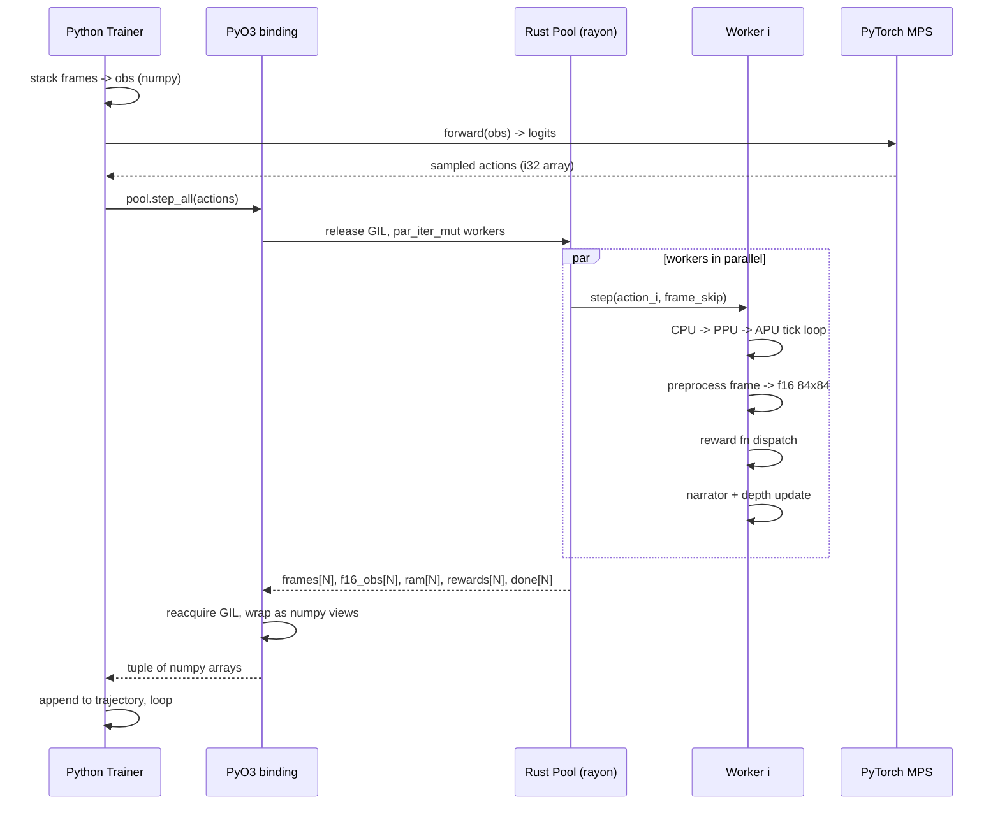
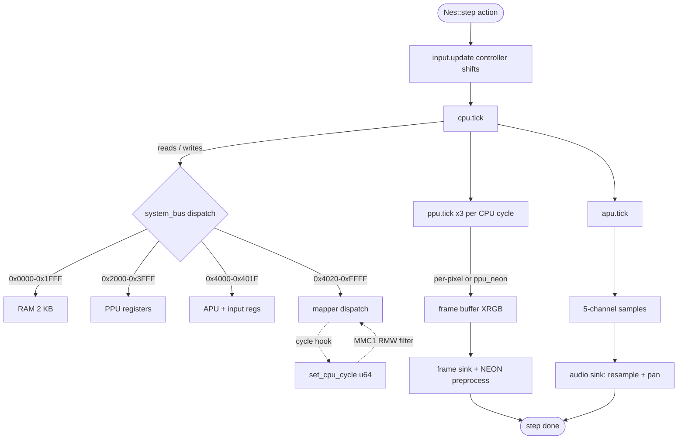
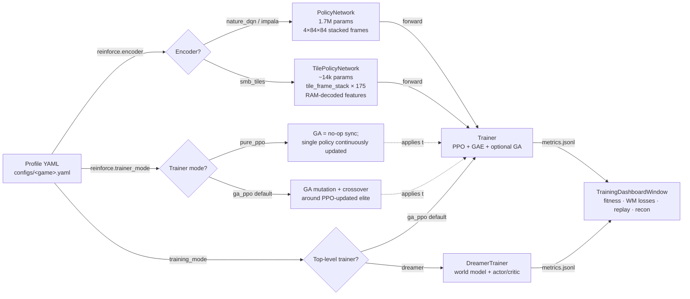
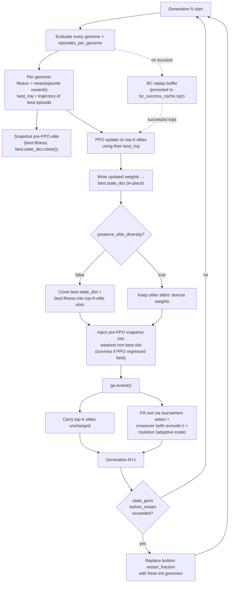
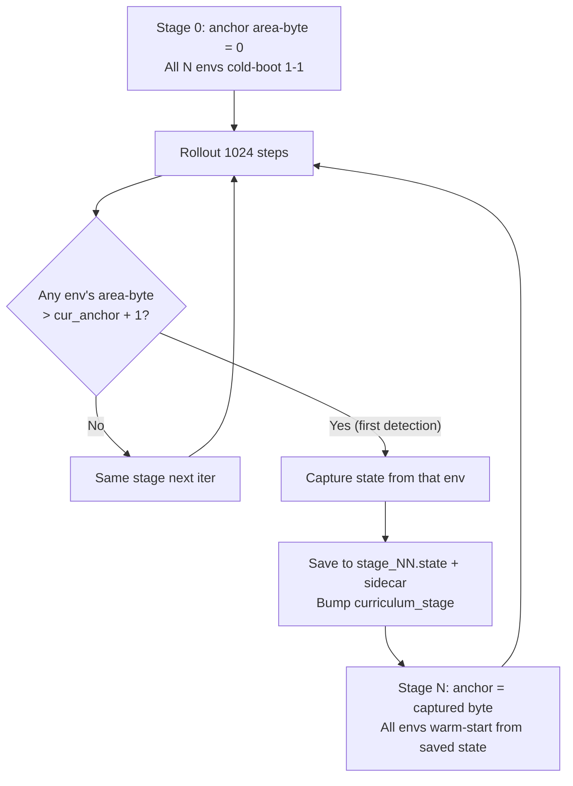
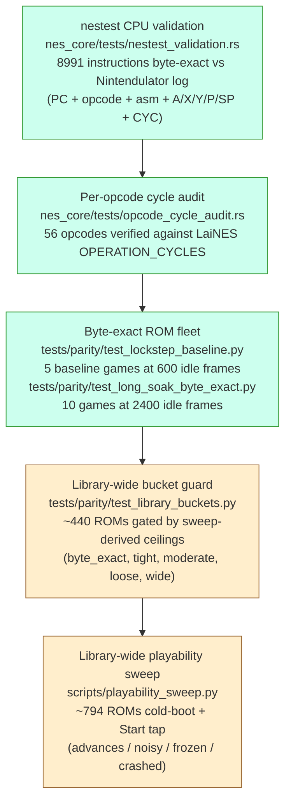

# Architecture

A deeper dive into how the training lab fits together. For the short version,
see the top-level `README.md`. For the roadmap to public release, see
`docs/proposals/unified_rust_plan_v3.md`.

## Overview

This repository pairs a hand-written Rust NES emulator (`nes_core`) with a
PyTorch + PyQt6 training framework. The emulator runs N instances in-process
under a rayon worker pool; the trainer runs PPO + GAE on top of a genetic
algorithm, with optional behavior cloning warm starts. Everything per-step
lives on the Rust side behind a single PyO3 call.

## Language boundary

Python owns what is slow-moving or user-facing:

- PyTorch MPS inference and training (policy network, PPO updates, GA
  operators on `state_dict`s).
- PyQt6 GUI (ROM picker, training grid, metrics, reward tuning, replay).
- Checkpoint I/O, metrics JSONL, configuration YAML parsing.
- Narrator caption templates and depth memo persistence (`*.jsonl`).

Rust owns what runs every step:

- 6502 CPU, PPU, APU, mappers, mirroring, DMA.
- Reward functions (byte-exact ports of the original Python rewards).
- Frame preprocess (XRGB → gray → 84×84 → fp16) via NEON SIMD.
- Worker pool (rayon par_iter, zero IPC).
- Audio mixer (cpal stereo, 5-channel pan matrix, per-channel resampler).
- Depth tracker and narrator hot logic (RAM-delta detection).
- Versioned save state (`NCST\x01` magic, bincode body).

The split is deliberate: anything in the inner loop is Rust, anything in
the outer loop or the UI is Python. The PyO3 boundary is crossed once per
trainer step via `pool.step_all(actions)`.

## Emulator core — module layout

`nes_core/src/` is a single crate with the following module responsibilities.

### CPU
- `cpu.rs` — pure-Rust 6502 interpreter. Per-cycle dispatch via
  `Instruction.cycles: &[CycleFn]`. Passes blargg's CPU test suite. Runs on
  every target; the authoritative reference for the ASM path.
- `cpu_asm.rs` + `cpu_asm.s` — AArch64 assembly core gated on
  `#[cfg(all(target_arch = "aarch64", feature = "asm_cpu"))]`. 151 official
  opcodes + ~30 stable illegals (LAX, SAX, DCP, ISC, SLO, RLA, SRE, RRA +
  NOP variants). Unknown opcodes fall back cleanly to the Rust core.

### PPU
- `ppu.rs` — PPU state machine and per-pixel renderer. Supports a
  `skip_render` fast path used on non-display frames (e.g. 15 of 16 when
  `frame_skip=16`).
- `ppu_neon.rs` — batched NEON renderer. Currently gated behind
  `BatchedRenderMode` (Off by default) pending the v3 invalidation-tracking
  fix. When Replace mode lands, mid-scanline PPU state changes will fall
  back to per-pixel for the dirty scanline only.
- `metal_render.rs` — Metal compute shim behind the `metal` feature.
  Measured 10x slower than CPU for per-frame palette expansion because of
  kernel-launch overhead; kept as a stub for future batched use.
- `oam_dma.rs` — OAM DMA state machine.

### APU and audio
- `apu.rs` — 5 channels (2 pulse, triangle, noise, DMC). NTSC ~43653 Hz
  native rate. Exposes `generate_sample_channels -> [f32; 5]` so the audio
  layer can pan channels independently.
- `audio.rs` — cpal Core Audio stream, 5-channel stereo pan matrix,
  per-channel linear resampler (43653 → 44100 Hz), worker-to-callback
  ring buffers. Solo/mute/master volume state owned here.

### Memory, bus, input
- `memory.rs` — 2 KB CPU RAM, open-bus logic, PPU register mirroring.
- `system_bus.rs` — the CPU's view of the world. Routes reads and writes
  to RAM, mappers, PPU registers, APU registers, and the controller port.
- `input.rs` — controller state (8-bit shift register per port).

### Cartridges and mappers
- `cartridge.rs` — iNES 1.0 + NES 2.0 parser, lenient on reserved bytes,
  MD5 hash of the payload for profile dirty-detect. NES 2.0 byte 10 is
  parsed as two nibbles (low = volatile PRG-RAM shift, high = battery
  PRG-RAM shift); the parser sums both regions. Reading only the low
  nibble used to silently drop battery-only carts' SRAM (Zelda
  `flags10=0x70`), which crashed the game on boot via open-bus reads.
- `mapper.rs` — `MapperEnum` dispatch via `enum_dispatch`. Trait
  includes a `set_cpu_cycle(u64)` hook (default no-op) called from
  `Nes::tick` once per CPU cycle. Mappers that need cycle-precise
  quirks (currently MMC1's RMW consecutive-write filter) read it.
- `mapper/mapper0.rs` … `mapper/mapper85.rs` — per-mapper state and bank
  switching. MMC5 audio split into `mmc5_audio.rs`. VRC2/VRC4 share
  `vrc24.rs`; VRC6 + VRC6 audio split into `vrc6.rs` + `vrc6_audio.rs`.
  MMC1 (`mapper1.rs`) implements the consecutive-write filter:
  `INC $FFFF` and other RMW opcodes do dummy-write + real-write on
  back-to-back CPU cycles; real MMC1 hardware ignores the second
  write, and we now match that.

### Pool, FFI, preprocess
- `pool.rs` — rayon worker pool. Holds `Vec<UnsafeCell<Worker>>` behind a
  `Sync` wrapper so `par_iter_mut` can run N workers concurrently with
  per-index exclusivity. `catch_unwind` per worker isolates panics;
  `pool.set_panic_isolation(False)` turns isolation off for production
  hot paths where a panic should fail loud.
- `python.rs` — PyO3 bindings. Zero-copy in: `PyReadonlyArray1<'py, i32>`
  for actions. Zero-copy out: numpy f16 arrays for observations.
- `preprocess.rs` — NEON XRGB → gray → 84×84 area resize → f16. Baked
  `/255.0` into the fp16 conversion so the trainer can skip the
  CPU→MPS normalize kernel.
- `sink.rs` + `sink/` — frame + audio sink abstractions so the GUI can hand
  in a callback and receive frames without copying through Python.

### Training-side helpers (still in Rust)
- `rewards.rs` — per-game reward functions (Mario, Zelda, Contra, Mega Man,
  Castlevania, Metroid). Dispatch via `build_reward_function(profile)`.
- `narrator.rs` — RAM-delta event detection (first dungeon entry,
  triforce pickup, depth record, etc.).
- `depth_tracker.rs` — per-genome deepest-RAM-key record for
  curriculum auto-promotion.

## Data flow — one `pool.step_all` call



Per the post-PGO hot-path baseline on 16 workers at `fs=16`:
- `pool.step_all` is ~84% of wall-time.
- PyTorch MPS forward is ~10%.
- Everything else (reward dispatch, narrator, depth, numpy wrap) is under 1%.

## Hot path — `Nes::step`



The `set_cpu_cycle` dotted edge is the per-CPU-cycle hook used by
mappers that need to detect back-to-back register writes (currently
only MMC1, for the RMW dummy-write filter).

## Mapper tree

```mermaid
graph TD
    Root[Supported mappers<br/>36 total / 99.9% of US library]
    Root --> Discrete[Discrete logic]
    Root --> MMC[MMC family]
    Root --> Konami[Konami VRC]
    Root --> Nintendo[Namco / Sunsoft / Tengen]
    Root --> Multicart[Pirate / Multicart]

    Discrete --> NROM[NROM 0]
    Discrete --> UxROM[UxROM 2]
    Discrete --> CNROM[CNROM 3]
    Discrete --> AxROM[AxROM 7]
    Discrete --> Colordreams[Colordreams 11 / 66]
    Discrete --> CPROM[CPROM 13]
    Discrete --> BNROM[BNROM 34]
    Discrete --> Camerica[Camerica 71]
    Discrete --> Nina03[Nina-03 79]

    MMC --> MMC1[MMC1 / SxROM 1]
    MMC --> MMC3[MMC3 / TxROM 4]
    MMC --> MMC5[MMC5 / ExROM 5 + audio]
    MMC --> MMC2[MMC2 / PxROM 9]
    MMC --> MMC4[MMC4 10]
    MMC --> TxSROM[TxSROM 118]
    MMC --> TQROM[TQROM 119]
    MMC --> NWC[NWC 1990 105]

    Konami --> VRC2a[VRC2a 22]
    Konami --> VRC2b[VRC2b 23]
    Konami --> VRC4[VRC4 21 / 25]
    Konami --> VRC6[VRC6 24 / 26 + audio]
    Konami --> VRC7[VRC7 85]

    Nintendo --> N163[Namco N163 19]
    Nintendo --> S4[Sunsoft-4 68]
    Nintendo --> FME7[FME-7 69]
    Nintendo --> RAMBO[Tengen RAMBO-1 64]

    Multicart --> Caltron[Caltron 6-in-1 41]
    Multicart --> Nes37[NES-ZZ 37]
    Multicart --> Nes47[NES-QJ 47]
    Multicart --> Nina06[NINA-06 / HES 113]
    Multicart --> Action52[Action 52 228]
    Multicart --> Quattro[Camerica Quattro 232]
    Multicart --> Maxi15[Maxi 15 234]
```



Live compatibility matrix in `reports/full_library.md`. Programmatic access:
`nes_core.supported_mappers()` from Python.

## Build pipeline

The Rust crate builds via `maturin` into an abi3 Python wheel. Typical
commands:

```bash
# Install everything (venv, deps, wheel, PGO)
bash scripts/install_macos.sh

# Rebuild the wheel only
cd nes_core && maturin develop --release --features "python,asm_cpu"

# Apply an existing PGO profile
bash scripts/pgo_build.sh apply

# Full PGO: instrument -> record profile -> rebuild
bash scripts/pgo_build.sh full
```

Feature flags:
- `python` — PyO3 module + cpal audio. Set by maturin.
- `asm_cpu` — AArch64 ASM 6502 core. Only effective on aarch64.
- `simd` — NEON/SSE palette and audio paths.
- `metal` — Metal compute PPU shim (off by default).
- `pgo` — build marker for the PGO wrapper script.
- `ppu_neon_stats` — per-frame counters for the batched PPU renderer.

Release profile settings in `nes_core/Cargo.toml`:
- `opt-level = 3`
- `lto = "fat"`
- `codegen-units = 1`
- `panic = "unwind"` — load-bearing. Under `panic = "abort"`, any
  `panic!()` in a worker takes down the Python process via `SIGABRT`.
  Unwind lets `catch_unwind` in `pool.rs` isolate the bad worker.
- `strip = "symbols"`, `overflow-checks = false`.

PGO on the hot path lifts throughput ~81% (710 → 1289 worker-steps/sec on
M4 Max) and shaves 47% off 1-generation wall-time.

## Memory and safety

`unsafe` surface is three call sites, all documented in `nes_core/SECURITY.md`:

1. `preprocess.rs` — NEON intrinsics. Bounded by `chunks_exact(48)` so every
   `vld3q_u8` reads exactly 48 bytes; tail runs the scalar path.
2. `pool.rs::drain_audio` — one `slice::from_raw_parts` to reinterpret
   `Vec<i16>` as bytes for `PyByteArray::new_bound`, which copies before the
   `Vec` drops.
3. `cpu_asm.rs` + `cpu_asm.s` — AArch64 ASM 6502 core. ROM is read-only via a
   raw pointer; RAM access is masked to `address & 0x07FF`; MMIO round-trips
   through the same Rust `SystemBus` the interpreter uses.

Panic isolation: every worker step runs inside `catch_unwind`. A panic marks
the worker dead; it returns zero-filled frames and RAM forever after so the
trainer can skip it without stalling. `pool.set_panic_isolation(False)` turns
this off for production runs where a panic should fail loud rather than be
papered over.

Save states carry a `NCST\x01` magic prefix; version bumps refuse to load old
blobs with a clear `PyValueError` rather than silently corrupting trainer
state.

## Training side

Three independent axes of training configuration, all per-profile:

1. **Encoder** (`reinforce.encoder`): pixel CNN vs. tile MLP
2. **Trainer mode** (`reinforce.trainer_mode`): `pure_ppo` vs. `ga_ppo`
3. **Top-level trainer class** (`training_mode`): PPO/GA stack vs. Dreamer



**Canonical SMB recipes documented in the literature** (uvipen 2020 pixel CNN
clears 31/32 levels; yumouwei 2022 RAM-grid MLP clears 1-1 in 10M steps; both
detailed in `reference_canonical_smb_ppo_configs` memory file). Two profile
variants ship for empirical comparison:

- **`configs/mario_canonical.yaml`** — tile MLP + `tile_frame_stack: 4` +
  `trainer_mode: pure_ppo` + canonical `r = v + c + d` reward
  (forward_progress=1.0, completion_bonus=50, death_penalty=-15, no
  shaping). Reproduces yumouwei's recipe end-to-end. Baseline for "does
  our trainer match the literature".
- **`configs/mario_tiles.yaml`** — same encoder, GA+PPO hybrid, shaped
  reward (survival/jump_clear/checkpoint bonuses). Experimental tuning
  surface; A/B against the canonical when testing reward-shaping ideas.

The two trainer classes (PPO+GA and Dreamer) coexist; profiles pick one via
`training_mode`. The two encoder paths coexist; profiles pick one via
`reinforce.encoder`. Both selections are independent — Dreamer can run on
pixels, PPO+GA can run on tiles, and the GUI dropdown can override either at
launch time.

### Knowledge inheritance — one PPO+GA generation



The two key channels by which knowledge flows generation-to-generation:
1. **GA elitism** — top-K genomes carry forward unchanged (post-PPO version).
2. **PPO gradient** — best.state_dict gets a gradient step using the best
   episode trajectory; new weights propagate to other elite slots iff
   `preserve_elite_diversity=False`.

The pre-PPO snapshot is the safety net: if PPO regresses `best`, the
snapshot's fitness on next-gen re-evaluation should rank it back into
the elite cut, restoring the pre-update policy. If PPO improved `best`,
the snapshot drops out naturally on the next sort.

### Policy networks
- **`src/models/policy_network.py`** — Nature-DQN CNN
  (Conv(32,8×8,/4) → Conv(64,4×4,/2) → Conv(64,3×3,/1) → FC(512) → actor + critic).
  ~1.7M params at 8 actions. Used by every profile that doesn't opt into a
  smaller encoder. Optional `encoder=impala` swaps the conv stack for a
  3-stage IMPALA ResNet (~3.4M params, better representation per param).
  Orthogonal init with PPO-standard gains, optional `LayerNorm` on the trunk.
- **`src/models/tile_policy.py`** — small actor-critic MLP
  (Linear(175,64) → LayerNorm → SiLU → Linear(64,32) → LayerNorm → SiLU →
  actor + critic). Pre-activation norm bounds the linear output before
  the nonlinearity to prevent variance blowup in a 14k-param net.
  ~14k params. Used in tile mode (currently SMB only). Same `forward_ac()`
  surface as `PolicyNetwork` so the trainer dispatches transparently.
  Init gains span 100×: trunk = √2 (orthogonal, ReLU/SiLU-tuned), actor
  head = 0.01 (near-uniform initial policy), critic head = 1.0. This
  gain heterogeneity is the reason `adaptive_mutation_scale` (see GA
  section) matters: a fixed mutation noise hits the actor 60×+ harder
  than the trunk relative to weight magnitude.
- **`src/models/world_model.py`** — DreamerV3 stack: encoder, RSSM
  (deterministic GRU + categorical 32×32 stochastic latent), decoder, reward
  head, continue head. ~9M params total. KL with per-sample free-nats
  regularization.
- **`src/models/dreamer_ac.py`** — Dreamer actor (straight-through categorical
  sampler) + critic with Polyak EMA target net. Operates on world-model
  latents, not raw obs.
- **`src/models/rnd.py`** — Random Network Distillation predictor + frozen
  target. Optional intrinsic-motivation bonus for sparse-reward games.

### Tile observations (`src/emulation/tile_observations/`)
RAM-decoded semantic observations as an alternative to raw pixels. Generic
`TileObservation` Protocol; per-game implementations decode that game's RAM
layout into a fixed-size feature vector. Currently:
- **`smb.py`** — SMB-specific 13×13 tile grid centered on Mario plus 6
  scalars (velocity, on-ground flag, powerup, lives, sub-tile X). Reads
  `$0500-$069F` (level metatiles) and the 5 enemy slots. 175 features total.

Adding a new game's tile encoder is one new file under
`tile_observations/<game>.py` and a one-line entry in
`get_extractor()`. No trainer changes.

### PPO + GAE (`src/training/trainer.py`)
Clipped objective, value head shared with the policy trunk, GAE-λ advantage
estimation over trajectories collected per generation. Runs on the elite
genome after each GA generation. Bulk numpy arrays are pre-allocated once
per generation to avoid per-step alloc churn. Supports symlog reward
transform, DrQ random-shift augmentation (pixel mode only), RND auxiliary
loss, GA-only warmup gens, and `preserve_elite_diversity` mode that skips
the post-PPO clone-overwrite so the elite pool keeps structurally-distinct
weights.

### DreamerV3 trainer (`src/training/dreamer.py`)
Self-contained alternative to PPO+GA. Selected via `training_mode: dreamer`
in the profile (or the GUI dropdown). Coordinates data collection through
the same Rust pool, world-model training on sequence batches from a replay
buffer (`src/training/replay_buffer.py`), and actor/critic training on
imagined latent rollouts. Atomic checkpointing every N train steps, auto-
resume on next launch. Reconstruction visualization is dumped every 10
steps to `<checkpoint_dir>/dreamer/reconstruction.npy` for the dashboard.

### Genetic algorithm (`src/training/genetic_algorithm.py`)
Tournament selection, uniform crossover, Gaussian mutation on PyTorch
`state_dict`s. Runs once per generation boundary. Genome names
(`genome_names.py`) persist across mutation and crossover so stream
viewers can follow specific lineages. Stale-best restart fires when the
all-time best hasn't improved in `stale_gens_before_restart` gens (set to
0 to disable, useful when the elite needs uninterrupted PPO time).

**Adaptive mutation scaling** (`adaptive_mutation_scale: true` in
`ga_params`) scales noise by each tensor's running std so a layer
initialised with gain 0.01 (actor logits) and one with gain √2 (trunk)
both receive mutation pressure proportional to their natural weight
magnitude. With fixed-noise mutation, a single `mutation_std` either
scrambles the small-gain head or under-perturbs the trunk; the policy
network's PPO-paper init gains span ~100×, making one knob unable to
fit both. Adaptive mode interprets `mutation_std` as a *fraction of
each tensor's own std*, layer-uniform.

**Crossover with cloned parents.** When `preserve_elite_diversity=False`
(trainer-side) clones `best.state_dict` into multiple population slots,
tournament selection can pick the same elite twice. Per-element coin
flips on identical tensors yield no variation, collapsing crossover to
"child = parent_a unchanged" and leaving mutation as the only diversity
source. `_tournament_select(exclude=parent_a)` deduplicates the second
pick to prevent this.

```mermaid
flowchart TD
    Start[Generation N] --> Eval[Evaluate population]
    Eval --> Sort[Sort by fitness]
    Sort --> Elite["Carry top-K elites unchanged<br/>(elite_fraction)"]
    Sort --> NonElite[Bottom (pop_size - K)]
    NonElite --> TS1["parent_a = tournament_select()"]
    TS1 --> TS2["parent_b = tournament_select(exclude=parent_a)"]
    TS2 --> CO[Crossover: per-param coin flip]
    CO --> Mut{adaptive_mutation_scale?}
    Mut -- yes --> AdMut[noise = randn × mutation_std × tensor.std]
    Mut -- no --> FixMut[noise = randn × mutation_std]
    AdMut --> Child[Child genome]
    FixMut --> Child
    Elite --> NextGen[Generation N+1]
    Child --> NextGen
    NextGen --> Stale{stale_gens<br/>exceeded?}
    Stale -- yes --> Restart[Replace bottom restart_fraction<br/>with fresh-init genomes]
    Stale -- no --> Eval
    Restart --> Eval
```

### Curriculum (`src/training/curriculum.py`)
Stage progression driven by success rate. Stage transitions can swap the
start state so stage 2 drops agents into Dungeon 1, stage 3 into Dungeon 2,
etc. Depth memo (`checkpoints/depth_memo.jsonl`) tracks new-record RAM keys
for auto-promotion.

### Behavior cloning (`src/training/behavior_cloning.py`)
Supervised warm start from a recorded play file. Writes `.state.bin` binary
snapshots (same `NCST\x01` format) so the trainer can hand the run off
byte-exact. Used as an optional stage 0 before the GA starts exploring.
Multi-demo aware: pass a list (or a directory) of `.state.bin`/`.fm2` files
and the pipeline replays each from a cold-boot env, concatenating the
(state, action, reward) tuples for richer state coverage. BC seed cache
key includes encoder name + frame_skip so swapping architectures auto-
invalidates the cache.

State-action alignment in `build_dataset` matches the runtime decision-
point convention: each emitted pair is `(state_BEFORE_chunk,
action_DURING_chunk)`. The state recorded is the network's input AT
the decision boundary (start of the next frame_skip window), paired
with the action the demo's player chose for that window. This requires
`FrameStacker.get()` / `TileFeatureStacker.get()` to sample the
chunk-start state without mutating the ring buffer.

### Vanilla PPO mode — single policy, N rollout envs
Activated via `reinforce.trainer_mode: vanilla_ppo`. Bypasses the
GA loop entirely; the N workers in `RustPool` (default 30, configurable
via GUI) become parallel rollout collectors for ONE shared `_ppo_net`.
Per iteration:

1. **Iter-boundary reset**: `pool.reset_all()` cold-boots every env.
   If the SMB curriculum is past stage 0, ALL envs then load
   `current_stage_state` via `pool.load_worker_state(i, blob)`,
   followed by a no-op `step_all` to flush fresh post-restore frames
   into init_results for stacker re-seeding.
2. **Rollout collection**: for `rollout_steps` (default 1024) ticks,
   stack the N envs' observations into one batch, run the policy's
   actor+critic forward, sample actions, step the pool, record
   `(obs, action, reward, value, log_prob, done)` for each (env, step).
   When `done` fires for env `i`, mark `active_in_iter[i] = False` and
   call `pool.set_worker_done(i, True)` to short-circuit emulation.
3. **Mid-rollout curriculum capture**: on each step, if any env's
   area-byte `wl_packed > cur_anchor + 1` (skipping the cutscene
   transition byte) AND `smb_pending_capture is None` (first detection
   wins per stage), snapshot that worker's state via
   `pool.save_worker_state(i)`. The first-detection-only gate is
   critical — without it the variable gets overwritten each step and
   the saved state ends up being Mario's mid-level death position
   instead of level-entry spawn.
4. **Bootstrap V(s_T)** from the final observation per env.
5. **GAE-λ backward sweep** per env, masking across done boundaries.
6. **Global advantage normalization** across the full
   (rollout_steps × num_envs) batch.
7. **K-epoch PPO update**: flatten, shuffle, minibatch SGD over
   the rollout with PPO's clipped surrogate + Huber value loss +
   entropy bonus. Default 10 epochs × 60 minibatches each = 600
   gradient steps per iteration.
8. **Curriculum advance**: if `smb_pending_capture is not None` AND
   `n_past_stage > 0`, persist the captured state to
   `checkpoints/smb_curriculum/stage_NN.state` + sidecar
   `stage_NN.meta.json` (anchor byte). Bump `smb_curriculum_stage`.
   All subsequent iters warm-start from the new state until the
   next advance fires.
9. Checkpoint every 10 iters to `vanilla_ppo_iter_NNNNN.pt`.
10. **Auto-resume on startup**: scan checkpoint_dir for the highest
    `vanilla_ppo_iter_*.pt`, load `net.state_dict` + Adam state.
    Load all `smb_curriculum/stage_NN.state` files; anchor byte read
    from sidecar JSON (or auto-derived for legacy files without one
    by briefly loading the state and peeking ram[$075F]/[$0760]).

The match-to-literature reason for this mode: yumouwei's
super-mario-bros-reinforcement-learning and uvipen's
super-mario-bros-PPO-pytorch both converge on SMB 1-1 using
exactly this shape. The GA-PPO hybrid (`ga_ppo`, `pure_ppo`) mixes
data from 30 different policies into PPO's gradient and breaks
the stable-policy-across-updates assumption; vanilla PPO doesn't.

#### Save-state curriculum — whole-pool level progression



Why each gate matters:
- `byte > cur_anchor + 1` (not just `> cur_anchor`): SMB's `$0760` is
  internal area index; the value transiently bumps to a CUTSCENE byte
  (typically anchor+1) when Mario touches the flag, BEFORE the new
  level's gameplay-area byte takes hold. Capturing at the cutscene
  byte saved a mid-cutscene state where Mario's controls are inert,
  loading 30 envs from it ends in game-over rather than level entry.
- `smb_pending_capture is None` (first-detection-only): without this,
  the variable overwrites every step Mario is past the anchor, and
  the iter-end value is Mario at the LAST mid-level position (e.g.,
  about to die) instead of FIRST level-entry spawn (x=0).
- Anchor stored in sidecar JSON (`stage_NN.meta.json`): on restart,
  in-memory anchors must be reconstructed exactly or the capture
  gate degrades (sentinel `-1` made `byte > -1 + 1 = byte > 0` true
  for any non-cold-boot byte, including the cutscene transition,
  which is how stage 1→2 incorrectly promoted to anchor=1 in early
  testing).

The corresponding Rust dep: `pool.load_worker_state` MUST reset
`w.frame_cycle_target = None` after `apply_state`, else the cached
cycle target from before load is below the loaded state's `nes.cycles`
and `advance_one_frame`'s while loops skip — NES never ticks, PPU
never re-renders the loaded state, screen freezes. Fixed in
`nes_core/src/pool.rs` 2026-05-14.

### BC anchor — preserving rare clears across PPO drift
The trainer maintains an in-memory `_bc_replay_buffer` of successful
trajectories captured during evaluation. When a clear lands, the
trajectory (obs, actions, rewards, fitness, `genome_id`) goes into the
buffer (FIFO, capped at `bc_replay_max_buffer`). BC replay then trains
a fresh network on the buffer's most recent `bc_replay_train_window`
entries (default 3; canonical SMB uses 1 for single-trajectory
coherence) and injects the trained network into the weakest population
slot at the captured fitness — high enough that GA elitism picks it
up as the next elite, or in pure-PPO mode that `evolve()` broadcasts
it to every slot.

Trigger logic fires BC replay on either condition:
1. **Immediate** — `_last_bc_buffer_size` is tracked across generations;
   if the buffer grew this gen (new clear captured), BC fires at the
   end of the same generation rather than waiting for the modulo
   schedule. Closes the "PPO drifts away from the clear before the
   anchor lands" window.
2. **Modulo** — every `bc_replay_every_gens` generations (default 20)
   the latest buffered trajectory is re-anchored, refreshing the
   inject against any policy drift since the last fire.

After injection, the persistent Adam optimizer is cleared
(`self._ppo_optimizer = None`). The next PPO update rebuilds Adam from
zero moments, so the optimizer's stale `m`/`v` state from the pre-BC
policy's gradients can't pull the freshly-injected BC weights back
toward the failing policy. This matters most in pure-PPO mode where
`evolve()` broadcasts the BC-injected slot to every slot — without
the optimizer reset, the very next PPO update on the new universal
elite would apply pre-BC momentum to post-BC parameters.

### Reward functions (`src/utils/reward_functions/__init__.py`)
Thin Python dispatcher (~40 LOC) that calls `nes_core.build_reward_function`
with the game profile. All six games implemented in Rust (`rewards.rs`).
Byte-exact parity with the old Python implementations was verified
pre-deletion. Mario's reward function ships with several positive-
reinforcement signals stacked on top of basic forward progress:

| Signal | Mechanism | Default | Purpose |
|---|---|---|---|
| `forward` | Δmax_x_visited × forward_weight | always on | Backtrack-free progress reward |
| `checkpoint` | Per-x-position lookup; once per episode each | per-profile | Dense gradient at known obstacles |
| `air` | Per-step bonus when airborne AND vel_x>0 | per-profile | Direct gradient on jump-while-running |
| `jump_clear` | Fires once per airborne→ground transition with ≥`min_dx` X-units forward in air | per-profile | Positive reward for productive jumps (pits, Goombas) |
| `survival` | Fires +bonus every `block_steps` compute() calls | per-profile | Steady drip for "stay alive long enough to attempt the maneuver" |
| `score` | Δgame_score × score_weight | always on | Tied to in-game score progression |
| `completion` | One-shot on flag-touch | always on | Sparse but huge reward for level clear |
| `death` | One-shot on player-state DYING/DEAD | always on | Optional negative — set to 0 for carrot-only |
| `pit_fall_extra` | Adds to `death` when Mario was airborne with Y>200 | per-profile | Death-cause differentiation |
| `time_penalty` | Constant per-step | per-profile | Implicit timeout pressure |

Mario's `LEVEL_1_1` checkpoints are calibrated to bridge known plateau
zones — e.g. the 1640→2100 dead zone (added 1800/+175, 1980/+300) and
the staircase→flag zone (boosted 2900 from 1000→2000, added 3000/+1500).
Each addition was driven by a specific observed plateau in training.

Enable per-profile via `reward_weights.checkpoint_scale: 1.0`; set to 0
to disable dense checkpoints.

### Training dashboard (`src/gui/training_dashboard.py`)
Single-pane observer window. Reads `checkpoints/metrics.jsonl` directly
(no trainer-side queue). Panels: best/avg fitness, reward signal stack,
PPO learning telemetry (loss/policy/value/entropy), depth + curriculum
success, world-model losses (Dreamer mode only), recent depth records,
recent highlight clips, replay-buffer fill, and a live world-model
reconstruction strip showing original vs. decoded frames. Replaces the
older standalone `MetricsWindow` as the primary "watch learning happen"
surface.

## Audio

`nes_core::audio::AudioMixer` owns a single cpal Core Audio stream,
stereo (`channels: 2`), 44100 Hz. Every worker pushes PCM into a per-instance
ring; the cpal callback drains all rings, applies the 5-channel pan matrix,
and sums into the stereo output.

- Resampler: per-channel linear interpolation from the APU's native
  43653 Hz up to 44100 Hz.
- Pan matrix (`PAN_MATRIX[5]`): pulse 1 slight-left, pulse 2 slight-right,
  triangle center, noise center, DMC slight-left.
- Solo mode: `AudioMixer::solo(worker_id)` mutes every other worker's
  contribution with a 5 ms fade; the GUI's audio-mixer window drives this.
- Worker ring cap: ~150 ms of samples (~6.5 KB per worker) so fast-forward
  emulation cannot grow audio buffers unboundedly.

The Python side (`src/audio/ram_music.py`) is a thin façade — 147 LOC down
from 807 pre-migration. No chiptune synth or NSF playback; real APU audio
only.

## GUI

`src/gui/main.py` is the app controller. On start it constructs the
`Pool`, spawns the in-process trainer thread, and opens the selected
windows.

- `main_window.py` — ROM picker, start state, profile, reward overrides,
  instance/population/episode knobs, live metrics readout. Trainer
  dropdown selects `(profile)` / `GA + PPO` / `DreamerV3` and overrides
  the profile's `training_mode` at launch. Multi-pick BC demo picker
  (⌘-click) feeds a colon-joined list to the trainer's BC pipeline.
- `training_dashboard.py` — unified observer view (replaces the older
  `MetricsWindow` as the primary surface). Five plot panels +
  side-pane with replay-fill bar, depth records list, highlight clips
  list, and a live world-model reconstruction strip.
- `emulator_grid.py` — NxN live frame grid. Pulls from the pool's frame
  callback at 30 fps.
- `metrics_window.py` — legacy three-panel metrics view, still
  importable but no longer auto-opened on Start.
- `reward_tuning_window.py` — live sliders for reward weights. Changes
  apply at the next episode boundary.
- `audio_mixer_window.py` — per-instance mute/solo + master volume.
  Maps directly to `nes_core.AudioMixer` modes.
- `play_window.py` — keyboard-driven single-emulator session; writes
  `NCST\x01` binary snapshots via `env.save_state()`.
- `replay_window.py` — loads a checkpoint, drives one emulator with the
  best genome's policy. Prefers Core ML / ANE inference when a paired
  `.mlpackage` exists (~0.08 ms/fwd) else PyTorch MPS (~0.65 ms/fwd).
- `highlight_recorder.py` — per-worker ring buffer; flushes the last 4
  seconds to `highlights/*.mp4` when a banner event fires.

## Validation harnesses

Five layers of test, each catching a different class of bug. They form
a pyramid: tighter, narrower tests at the top; broader, looser tests at
the base.



Layer responsibilities:

- **nestest** is the CPU spec gate. Any opcode change re-runs this
  first. The test is in Rust so it runs in seconds without Python.
- **opcode cycle audit** is the cycle-accuracy gate for the official
  6502 timing tables. Catches off-by-one cycle bugs that nestest
  doesn't exercise.
- **byte-exact fleet** lockstep N idle frames against `nes-py` for the
  five known-good baseline games. The strictest end-to-end test we
  have on the integration of CPU + PPU + APU + mappers.
- **library buckets** stops a ROM regressing by more than one bucket
  vs the committed `parity_sweep.json` baseline. Catches changes that
  silently break a class of mappers without landing on a baseline ROM.
- **playability sweep** is the loosest gate: cold-boot a ROM, idle to
  title, multi-tap Start, observe RAM change. Catches games that
  *boot* (parity_sweep tests that) but *don't progress* (this catches
  that). The "crashed" bucket — PC ends in $FFE0-$FFFF with frozen
  zero-page — was the specific signal that exposed the Bill & Ted's
  MMC1 RMW bug and the `roms/zelda.nes` PRG-RAM nibble bug.

When a "ROM looks broken" report arrives, run them in order: nestest,
then opcode audit, then byte-exact, then bucket, then playability. The
first one that fires names the bug-class layer.

## Cross-references

- `README.md` — top-level overview.
- `nes_core/SECURITY.md` — full `unsafe` audit, FFI error mapping, save
  state format, ASM fuzz results.
- `nes_core/KNOWN_ISSUES.md` — per-mapper quirks and open bugs.
- `docs/proposals/unified_rust_plan_v3.md` — the authoritative roadmap to
  public release.
- `docs/proposals/archive/hot_path_baseline.md` — measured bottleneck percentages.
- `docs/proposals/pgo_results.md` — PGO measurement writeup.
- `reports/full_library.md` — ROM compatibility matrix.
