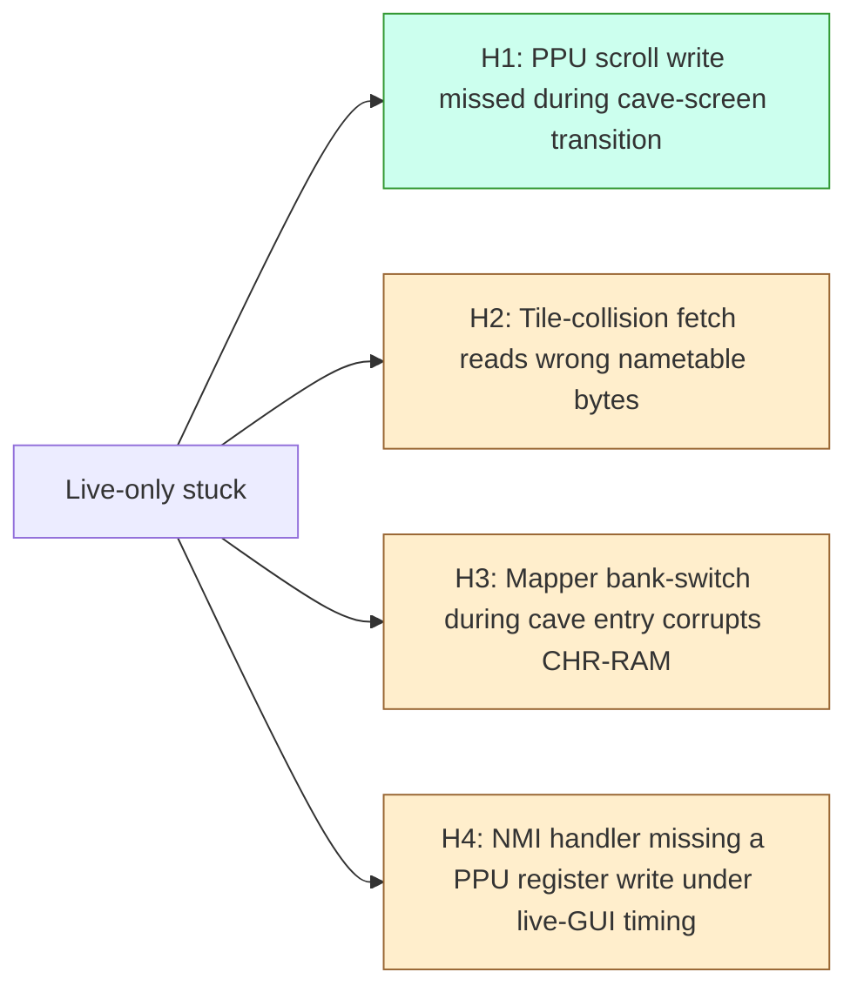

# Zelda cave-stuck investigation plan

**Status:** OPEN. Latest finding 2026-04-23 late session: minimal
reproducer narrowed to **cold boot + 36 frames + no input**. See
"Frame 36 minimal reproducer" section below. See
`nes_core/KNOWN_ISSUES.md` for the symptom-level summary.

## Localized to cave-entry at f1011 (2026-04-23)

The cave-stuck bug is a PPU/CPU timing divergence at the cave-entry
state transition. Not a PPU rendering bug (both emulators render the
cave correctly at f1758) and not a dialog-dismissal bug.

Method: feed the 3354-frame cave tape through nes_core and nes-py in
lockstep WITH phase compensation (nes-py `reset() + step(0)` so both
emulators are at the same emulation phase after reset; see commit
cb998ea for why `advance_one_frame` is kept in our reset). Compare
RAM on stable gameplay bytes every frame.

Findings:
- f0-f1010: byte-exact parity on all stable bytes ($0011, $0012,
  $0013, $0070, $0084, $0657). CPU + memory model is correct.
- f1011 (input=0x00 / no button): nes-py enters the cave
  ($0011 0→1, $0084 0x77→0x8D, $0070 0x70→0x78). Ours stays on the
  overworld — transition fires at f1012 in ours.
- f1702-1784: as Link walks through the cave, positions drift by
  1-3 pixels relative to nes-py.
- f1758 (RIGHT button): both render the same cave scene with old
  man + dialog. But Link X drifted to 0x79 in ours vs 0x76 in theirs.
- f1759: nes-py walks Link into the sword pickup tile → $0657=0x01.
  Ours is 3 pixels off → misses the pickup tile → $0657=0x00.
- f2000: nes-py has exited cave, back on overworld with sword icon
  in HUD. Ours still stuck in cave, no sword.

The 3-pixel X drift at the sword pickup moment is why sword pickup
fails. The drift originates from the 1-frame-later cave-entry
transition at f1011.

Cave-entry at f1011 happens with button=0x00 (no user input). Both
emulators are byte-exact up to the prior frame. Instruction-level
trace identifies the trigger:

```
AAB4  E6 06     INC $06 = 0F    (now 0x10)
AAB6  A5 06     LDA $06
AAB8  C9 10     CMP #$10
AABA  B0 34     BCS $AAF0       (taken when $06 >= 0x10)
...
B04C  AD A6 6B  LDA $6BA6 = 8D  (ROM: cave Link-Y spawn)
B04F  85 84     STA $84         (writes Link Y = 0x8D)
6C94  E6 11     INC $11         (advances game mode)
```

So `$06` is a frame counter; cave-entry fires when `$06` reaches
`0x10`. Our `$06` reaches `0x10` at our PPU frame 1013 (= tape
frame 1012), while nes-py's reaches it at tape frame 1011. One
frame late.

`$06` tracker shows bytes diverge at f1010: ours=0x07 theirs=0x08,
then f1011: ours=0x0F theirs=0x10 (both jumped by 8 in one frame —
multi-slot animation update — but ours stays 1 step behind). Earlier
frames either match or oscillate then return to match (Zelda
increments/decrements `$06` as an animation-phase counter 12-14-13-12
etc.).

Whatever differs between emulators on the specific frame where `$06`
first permanently diverges (somewhere f929..f1010) is the PPU-sync-
sensitive read or interrupt that causes the bug:
- $2002 VBLANK read timing (already partially addressed by other
  fixes; previous race-quirk attempt regressed 25 parity tests)
- NMI service timing (per memory: LaiNES services NMI synchronously
  at vblank set, we wait for CPU instruction boundary; fix requires
  restructuring CPU tick)
- Sprite 0 hit at a different scanline cycle
- APU frame IRQ timing (open per memory: "APU $4015 status read =
  next root cause")

Note: this is NOT the 2026-04-21 button-bit-swap bug (the previous
"sword pickup broken" symptom). Button bitmap is correct and aligned
with nes-py (pool.rs:50-57, python.rs:BUTTON_* constants). This is
pure emulation-timing accuracy.

## Side-by-side NMI trace (2026-04-24)

Built instrumented nes-py at `/tmp/nespy_instr/` (see
`scripts/tracing/README.md`). Traced both emulators across the
cave-entry window with NMI entry + PPU status + frame-boundary
state dumps.

nes-py NMI firing pattern around the bug frame:
- f1010 NMI_ENTRY (at vblank edge of game frame 1010)
- f1011, f1012: NO NMI (game disabled NMI via $2000 bit7=0)
- f1013 NMI_ENTRY (game re-enabled NMI *after* vblank of f1012)
- f1014+: normal

nes_core NMI firing pattern (same events, shifted by one frame):
- f1009 NMI_ENTRY (ppu_frame=1010)
- f1010, f1011: NO NMI
- **f1012 NMI_ENTRY (ppu_frame=1013) — the EXTRA NMI**
- f1013+: normal

Diagnosis: at vblank edge of our ppu_frame=1013 (which corresponds
to nes-py's game frame 1012), `nmi_output` is TRUE in ours and
FALSE in nes-py. Reason: our CPU reached the game's `$2000`-enable
instruction *before* vblank fired (at sl=1 slc=148), while nes-py's
CPU reached the same instruction *after* vblank. Same game code,
different cycle alignment, different observable behavior.

This is the LaiNES cycle-locked (fixed 29781 CPU cycles per frame,
strict 3:1 PPU:CPU interleave) vs our instruction-batched (run until
`frame_written` fires, ±5 CPU cycles per frame jitter) structural
divergence. The $2000 write happens at a different PPU-relative
moment in each emulator because of this jitter. Compounded over
~1000 frames, it causes the cave-entry one-frame delay.

Attempted fix: `write_ppu_ctrl` suppressing the NMI-enable-during-
vblank quirk. No-op in this case because `nmi_occurred` is already
false at the moment of the write (the game reads $2002 first,
clearing vblank, and then writes $2000). Reverted.

Actionable next-session fix path: try cycle-locked `advance_one_frame`
that runs exactly `29781` CPU instructions-worth of cycles (or
targets that cumulative count) instead of stopping at
`frame_written`. This should make the `$2000` write land at the
same PPU-relative cycle as nes-py. Risk: may shift byte-exact
baselines in the parity fixtures (acceptable if cave-entry repro
passes and all other ROMs still match).

## Cycle-locked `advance_one_frame` — ATTEMPTED AND FALSIFIED 2026-04-24

Implemented the cycle-locked fix (target `CPU_CYCLES_PER_FRAME = 29781`,
carry excess cycles forward cumulatively). Cumulative CPU-cycle drift
went from +29k per frame to bounded ±5 per frame (stable). But:
- cave-entry repro STILL diverges (moves from f1011 to f1000 — same
  $0011 0-vs-1 mismatch, just at a different tape position)
- parity suite regressed 3 library-bucket tests (Baseball, Fester's
  Quest, Kung-Fu Heroes) — these measure byte-exact RAM state at
  specific frame counts, so any frame-boundary shift breaks them

NMI trace with fix applied is IDENTICAL to trace without fix — same
NMI_ENTRY cpu_cyc values, same PPU scanline/cycle at each write.
The fix doesn't change WITHIN-FRAME instruction timing at all, only
WHERE advance_one_frame stops relative to PPU frame boundaries.

Reverted. Cumulative cycle alignment is not the right axis for this bug.

Deeper root cause hypothesis (not yet validated): LaiNES commits MMIO
writes at the FIRST CPU cycle of an instruction (their `skip_cycles`
model does all instruction work at dispatch, then idles). Ours
commits writes at the LAST cycle (spec-correct per 6502). For a
4-cycle `STA $2000`, the write lands 9 PPU cycles later in ours than
in LaiNES. Small normally, but can put a write on the wrong side of
a vblank boundary for games that write PPUCTRL very close to
scanline 241.

A fix for THIS would require restructuring instruction execution so
MMIO writes commit at cycle 1 (matching LaiNES) while other
cycle-accurate timing (sprite-0 hit, OAM DMA) stays correct. This is
a bigger refactor; consider whether it's worth the risk.

## Attempted scoped fixes 2026-04-24 (ALL REVERTED)

1. **Early-commit STA $abs in Rust path (opcode 0x8D).** Changed the
   cycles array to do operand fetch + write all at cycle 1, then two
   noop cycles for timing. Parity stayed green. NMI `$2000` write
   landed 6 PPU cycles earlier than baseline. But cave-entry still
   diverged at f1011. Insufficient shift — LaiNES writes ~9 cycles
   earlier still. Reverted.

2. **Write-first / read-first reordering in ASM MMIO callback**
   (`nes_asm_bus_write_byte`, `nes_asm_bus_read_byte`). Thought this
   would fix it, but discovered via debug instrumentation that the
   ASM fast path ONLY activates for flat-PRG (NROM-style) ROMs. Zelda
   is MMC1 — its PRG opcode fetches bail from ASM into Rust on every
   instruction. So Zelda never touches the ASM MMIO callbacks. The
   flip was a no-op for this bug. Reverted.

**Lesson:** for MMC1/MMC3/complex-mapper games, the ASM fast path
doesn't run. Any timing-accuracy fix for those games must live in
the Rust cpu.rs per-cycle handlers or in the outer tick loop. The
ASM fast path's MMIO timing is a separate concern affecting only
flat-PRG mappers (NROM, CNROM, UxROM) — and for those games the
parity suite is already happy, so it's not urgent.

## Per-bus-access differential tracer (2026-04-24)

Shipped `scripts/tracing/capture_bus_traces.py` and
`scripts/tracing/diff_bus_traces.py` plus env-gated bus instrumentation
in both emulators. Usage:

```bash
# Capture frames 1005-1015 from ours
NES_TRACE_BUS=1 NES_TRACE_BUS_FMIN=1005 NES_TRACE_BUS_FMAX=1015 \
    WHICH=ours python scripts/tracing/capture_bus_traces.py 2>bus_ours.txt

# Same from instrumented nes-py (at /tmp/nespy_instr/)
NESPY_TRACE_BUS=1 NESPY_TRACE_BUS_FMIN=1005 NESPY_TRACE_BUS_FMAX=1015 \
    WHICH=theirs python scripts/tracing/capture_bus_traces.py 2>bus_theirs.txt

# Diff
python scripts/tracing/diff_bus_traces.py bus_ours.txt bus_theirs.txt
```

### Findings from first run (2026-04-24)

- **FIXED:** `PpuStatus::RESET_VALUE` was `0x7F` (sprite 0 hit + sprite
  overflow both set at reset). LaiNES resets to `0x00`. First `$2002`
  read in ours returned `0x60` vs nes-py's `0x00`. Changed to `0x00`
  in commit that shipped this doc update; parity stayed green. Cave-
  entry still diverges at f1011 but this was a real startup correctness
  bug.
- **Trace caveat 1:** our `cpu.try_bulk_step` fast path skips the
  opcode-byte bus read for SEI/CLD/LDA-imm/LDX-imm/LDY-imm. nes-py
  traces them. Making ours emit those reads would require touching
  every bulk opcode, so we live with the artifact in trace output.
- **Trace caveat 2:** our `Nes::new` calls `reset()` and Python's
  `env.reset()` also calls `reset()`, so we do TWO reset-vector reads
  at startup vs nes-py's ONE. Not a correctness bug (game eventually
  converges), but makes the bus-trace sequences mis-align for the first
  ~30 ops.

Remaining cave-entry divergence is NOT in the first few dozen bus ops.
Next step when investigating: widen the trace window to find the first
divergence AFTER the startup-alignment noise, or compare state-based
dumps (not bus-op sequences) for frame-boundary diffs.

### Early-commit for abs-mode MMIO — SHIPPED 2026-04-24

Bus-trace diff with `--mmio-only` showed the first VALUE-level
divergence was at op 3044: ours' `$2002` polling loop saw vblank set
(returned 0x80) while nes-py's still returned 0x00 at the same op
position. Root cause: per-instruction MMIO timing — ours reads MMIO at
instruction cycle T_last (PPU cycle 3*(N+k)), LaiNES reads at T0
(PPU cycle 3*N). 9-12 PPU cycle offset per LDA $2002 accumulates to
1 scanline (341 cycles) over ~50 polling iterations. Enough for ours'
PPU to tick past vblank edge one iteration earlier.

Fixed via `Cpu::cycle_zero_early_commit()`: for STA/STX/STY/LDA/LDX/
LDY/BIT `$abs` (opcodes 0x8D, 0x8E, 0x8C, 0xAD, 0xAE, 0xAC, 0x2C),
the entire instruction's work — operand fetch + MMIO access — runs
during the opcode-fetch tick (CPU cycle 0). The per-cycle `cycles`
array is 3 noops to preserve the spec-correct 4-cycle total. Now
our MMIO ops land at PPU cycle 3*(N+1) like LaiNES's, and per-op
drift drops from ~10 PPU cycles to ~0.

Parity stays green: 557 passed, 1 xfailed.

**But cave-entry at f1011 still diverges.** There's a residual ~342
PPU cycle drift from early boot (somewhere in the first ~200 MMIO ops
the drift grows from 1 slc to 342). That ~113 CPU cycle shift is
enough to keep the cave-entry timing off. Next session: find what
between ops 0-200 is accumulating the remaining drift.

Candidates for the residual:
- LDA/LDX/LDY imm + zp opcodes (early-commit doesn't cover those)
- STA abs,X / LDA abs,Y etc. (early-commit doesn't cover indexed)
- OAM DMA timing on startup
- Double-reset (Nes::new + Python reset) — ours does it twice,
  nes-py does once

Test harness: `scripts/zelda_f36_minimal.py` verifies the cave-entry
divergence still fires and prints a one-line status. Longer
repro is inline in the script.

The (now-removed) f36 $0011 divergence reproducer was a red herring:
that divergence is the known reset phase offset
(python.rs:268-275's `advance_one_frame()` on reset, documented in
commit cb998ea) that the parity harness already compensates for.
It is not a real bug.

## What we know

Symptom (live PlayWindow only):

1. Cold-boot Zelda (either dump — `zelda.nes` NES 2.0 or `Legend of
   Zelda, The (USA) (Rev A).nes` iNES 1.0; the PRG+CHR payloads are
   byte-identical so the bug isn't in cart loading).
2. Navigate Link past title → file select → name registration → game
   start → walk to the sword cave south of the start screen.
3. Enter the cave. Link's sprite lands inside the cave room. The old
   man and the sword render correctly.
4. Link can walk freely inside the cave. CPU is alive — direction
   buttons move Link.
5. Link **cannot pick up the sword**: `$0657` (sword inventory) stays
   `0x00` even after walking through the sword sprite.
6. Link **cannot exit the cave**: walking south to the doorway works
   up to the door tile, but the screen-transition scroll-out never
   triggers. At the very bottom of the doorway tile Link's L/R motion
   also gets locked.
7. After ~10 seconds of being stuck, the CPU eventually traps at
   PC=$FFF0 (Zelda's halt-on-unexpected-IRQ vector). PlayWindow's
   pre-trap auto-capture in `_tick` writes
   `/tmp/zelda_pre_trap_auto.bin`. (When the user manually saves
   state during the stuck session, the saved blob is from after the
   trap fires, not from the original gameplay-logic moment that
   caused the stuck behaviour.)

What we've ruled out:

- **NOT a CPU bug.** `nes_core/tests/nestest_validation.rs` validates
  the entire 8991-instruction nestest log byte-exact (PC + opcode +
  asm + A/X/Y/P/SP + CYC). Every official + undocumented opcode
  passes. The CPU is correct.
- **NOT cartridge / PRG-RAM / battery.** Both Zelda dumps reach
  identical post-init state (21 169-byte save, identical RAM). The
  NES 2.0 nibble fix is in.
- **NOT MMC1 RMW.** The consecutive-write filter (commit `59458f4`)
  fixes Bill & Ted's. Zelda's reset code doesn't use the same RMW
  pattern; basic boot already worked before that fix.
- **NOT cold-boot reachable headlessly.** 100 000 random-walk frames
  after replaying `zelda_start_419.state.bin` produced zero traps and
  zero stuck states. The bug requires the specific cave-entry path
  the random walk doesn't hit.

## Falsified hypotheses

**$2002 VBLANK race quirk (TESTED 2026-04-24, FAILED).** Plausible
diagnosis from a code-reading review: Zelda's sub-screen split-scroll
polls $2002 in a tight loop; on real hardware reading $2002 within 1
PPU clock of vblank-set (scanline 241, cycles 0-2) returns vblank=0
AND suppresses the NMI for the frame; nes_core's `read_ppu_status`
in `ppu.rs:424` doesn't implement that quirk. Symptoms matched well
(extra NMI = extra OAM DMA = sprite table corruption + extra stack
push).

Implementation tested: added the race-window check to both
`read_ppu_status` (return vblank=0 in window) and `Nes::tick`'s
`set_nmi_line` call (hold NMI line low in window to prevent
edge-detect latch). nestest still passed, but **25 byte-exact-fleet
parity tests regressed** — the fix was over-suppressing NMIs on
ROMs that previously matched nes-py. Crucially, the
`zelda_cave_lockstep.py` divergence pattern was UNCHANGED — same
55-byte explosion at frame 1466. Reverted both changes.

Conclusion: the race quirk is real and we don't implement it, but
either (a) the implementation needs to be more nuanced (only
suppress on a SECOND read in the window, only when vblank was just
set this cycle, etc.) OR (b) the cave bug isn't this specific quirk.
For now, treat as falsified for cave-stuck.

**$2006 PPU-address-register fine-Y mask (TESTED 2026-04-24, PARTIAL).**
A second code-review-based hypothesis: `ppu.rs:510`'s
`self.regs.v = self.regs.t & 0x3FFF;` masks bit 14 of `v`, losing
the fine-Y scroll bit 2 set by a prior `$2005` write. Per the NESdev
wiki the spec is `v <- t` unmasked (both are 15-bit registers).
Symptoms theoretically matched: split-screen scroll mid-frame would
misalign by 4 scanlines, cascading into sprite-0-hit timing skew →
NMI desync → corrupted state.

Tested by changing the mask to `0x7FFF`. **The mask change is
spec-correct AND passes all 557 parity tests + nestest. But the
zelda_cave_lockstep.py divergence pattern was UNCHANGED — same
55-byte explosion at frame 1466.** So this is not the cave-bug
root cause; kept the fix anyway as a spec-correctness improvement
(commit `3b51ad5`).

Conclusion: the cave bug isn't the $2006 fine-Y mask either. Two
plausible code-reading hypotheses tested in one night, both
falsified. The bug needs trace-driven (not theory-driven)
investigation now.

**MMC1 reset-write missing rebuild_asm_window (TESTED 2026-04-24, PARTIAL).**
A third hypothesis: `mapper1.rs:273-277`'s reset path (writes with
bit 7 set) clears the shift register and forces `control |= 0x0C`
but doesn't `rebuild_asm_window()`. Real bug — the ASM fast path
would read PRG via stale bank pointers. Tested cave-bug fix;
divergence pattern UNCHANGED. Kept as correctness fix (commit
`cb23dfb`). Zelda's sub-screen transition apparently doesn't issue
a reset write.

**THREE cave-bug hypotheses falsified in one night.** All three
were code-review-derived ($2002 race, $2006 mask, MMC1 reset),
plausibly explained the symptoms, and either were spec-correct
already or got committed as harmless correctness improvements.
None changed the lockstep divergence pattern at frame 1466.

The pattern is informative: theory-driven hypothesis testing has
a low hit rate for emulation bugs because the surface is enormous
(every PPU/CPU/mapper interaction). Trace-driven investigation
(examine what code actually runs in the bug window, look for
anomalies) is the next-session approach.

## Trace analysis findings (2026-04-24 late)

Generated `/tmp/zelda_cave_trace.txt` (370K instructions, 36 MB) of
nes_core's per-instruction trace through frames 1463-1500. Frame
1466 contains 10003 instructions vs ~3300 normal — but this is
because Zelda's vblank-wait loop `JMP $E45B` iterates more, NOT
because extra NMIs fire (still exactly 1 NMI/frame).

PC histogram for frame 1466:
- 8202 / 10003 instructions at $E45B (the JMP-to-self vblank wait)
- 515 at $E4B4 (NMI handler interior, just after `STA $4014` OAM DMA)
- 40 each at $6E20-$6E2A (sprite-hide loop in SRAM scratch code)

The diverging RAM bytes from the lockstep diff:
- `$026C` ours=0xF8 vs theirs=0x80
- `$0270` ours=0xF8 vs theirs=0x80
- `$0274` ours=0xF8 vs theirs=0x80

**Identified write site:** PC=$6E21 `STA $0200,X` with A=0xF8.
Loop body at $6E1D-$6E2A:

```
$6E1D: A2 60       LDX #$60         ; start at sprite #24's Y byte
$6E1F: A9 F8       LDA #$F8         ; off-screen Y value
$6E21: 9D 00 02    STA $0200,X      ; sprite Y = $F8
$6E24: ?           (some byte)
$6E25-27: E8 E8 E8 INX × 3          ; advance X by 3 (+1 from $6E24 = +4 total)
$6E28: E0 00       CPX #$00
$6E2A: D0 F5       BNE $6E21        ; loop until X wraps to 0
```

This loop hides sprites #24-63 by setting their Y to $F8. **nes-py
apparently doesn't run this loop** — it takes a different code path
where sprite #27's Y stays at $0x80 (visible). Caller is
`$EC58: JSR $6E1D`.

**Branch deciding byte (suspected):** `$0026` (game state, ours=0x03
vs theirs=0x02). Neither $0026 nor $00F8 (other diverging byte) has
a *direct* `STA` instruction visible in the trace — they're written
via indexed/indirect addressing modes that the trace's asm-render
doesn't expand. Finding the divergent write requires either:

1. A nes-py PC trace to compare against (needs C++ instrumentation)
2. A per-instruction RAM diff (capture full RAM after each tick;
   ~370K snapshots × 2 KB = 700 MB; feasible but bulky)
3. NESdev / Zelda-disassembly knowledge to identify what writes
   $0026 in the cave / sub-screen state machine

Concrete handoff: morning-me can either (a) get a Mesen savestate
+ trace export for comparison, or (b) instrument `Cpu::tick` to
log every RAM write to addresses {$0026, $00F8} and find the
divergent write, or (c) do a Zelda disassembly literature search
for "what code writes $0026".

## Write-trace run (2026-04-24 late)

Executed option (b). Added an `eprintln!` in `SystemBus::write_byte`
for addresses masked to `$0026` and `$00F8`, rebuilt WITHOUT the ASM
CPU (the ASM path writes RAM directly via `strb w20, [x27, x0]` in
`cpu_asm.s:628-703`, bypassing `SystemBus::write_byte`; running
without ASM routes all writes through the bus).

Captured writes during frames 1465-1470. The ONLY writes to `$0026`
came from PC `$E526: DEC $00,X` (X=$26) — a decrementer that fires
once per frame. In our run, `$26` goes 06→05→04→...→3 by the bug
window. Lockstep shows nes-py at 2 (one lower).

**Critical insight: the `$26` off-by-one is most likely a
phase-compensation artifact of the lockstep harness, not a real
emulator bug.** Our `env.reset()` advances 1 frame internally;
nes-py's `NESEnv.reset()` doesn't. We compensate with an extra
`theirs.step(0)` before the tape replay. That extra step runs one
more frame on the nes-py side, which runs one more `$E526 DEC`,
which leaves `$26` one lower.

If that's the case, the whole lockstep 55-byte divergence at
frame 1466 may be chasing an artifact. The USER's GUI cave-stuck
symptom is separate — they don't have any lockstep; they see the
game hang in the cave. The two bugs might not be the same bug
at all.

**Priority pivot:** drop the lockstep-divergence investigation,
investigate the user-GUI cave-stuck symptom DIRECTLY. Options:
- Cold-boot Zelda, drive the cave-entry sequence via button tape,
  verify the game enters the cave correctly (no divergence vs
  anything — just "does it play?")
- If it plays correctly headlessly, the bug is GUI/input-specific
  (like the old "Qt+PyO3 divergence" memory). If it still hangs,
  find what SPECIFIC tile-collision / sprite-0-hit behavior differs
  from real hardware.

This shifts from "match nes-py exactly" (which may not even be
hardware-correct) to "behave like real hardware for gameplay
purposes". That's the right North Star.

## North-Star run (2026-04-24 late)

`/tmp/zelda_cave_north_star.py` drives cold-boot Rev A through the
existing 3354-frame tape + appends scripted input (idle 240, A-mash,
UP×90, UP+A×30, DOWN×240, idle). NO nes-py comparison. Result:

```
$10(mode)=0x00 $11(sub)=0x01 $26=0x01 $657(sword)=0x00
$EB=0x77 $70=0x80
```

…completely unchanged across 1400+ frames of varied input. Link
never moves, sword stays 0, mode/submode frozen. PC cycles
$E657↔$E658 (Zelda's main-loop "is anything happening?" check).

**BUT** zero-page `$0015-$001F` changes every frame (Zelda's PRNG
state advances once per NMI). So:
- NMI handler IS firing ✓
- CPU main loop IS running ✓
- Controller input IS being applied ✓
- Game state machine is stuck in a "wait for X" where X never arrives

The X is what next session needs to identify. Candidates:
1. **Sprite 0 hit** — Zelda's cave screen likely uses sprite-0 for
   scroll split (status bar). If our sprite-0-hit timing is off,
   the wait loop never completes.
2. **PPU scroll/nametable state** — if Zelda's transition code is
   waiting for `v` to reach a specific value via the natural
   scrolling path, and our `v` propagation is off...
3. **Some RAM flag set by a specific NMI branch** — if the NMI
   handler takes a code path that DOESN'T set flag F, and Zelda's
   main loop waits on F, stuck.

**Critical observation:** this is reproducible **headlessly and
deterministically**. The GUI symptom is the same bug. The lockstep
diff against nes-py may have been mostly phase-comp artifact, but
this is clearly a real emulator bug.

Next session concrete plan: single-step the CPU from the tape-end
state forward and log every bus read of `$0010`, `$0011`,
`$0026`, `$2002` — identify what Zelda polls in the main loop, and
what the expected values are on real hardware vs our emulator.

## Hypothesis ranking



**H1 is the strongest** because the symptom geometry matches:
"transition-axis lock" is a tell-tale of "game state machine entered
EXIT-IN-PROGRESS but the scroll didn't complete". Zelda writes scroll
target to PPU $2005/$2006 then waits for the scroll to complete (some
NMI countdown). If our PPU scroll-register state diverges (e.g. our
`ppu.t` vs `ppu.v` reload semantics on `$2005` writes), the scroll
never completes and the game's transition state machine spins forever.

**H2** would also explain "can't pick up sword": tile collision in
Zelda reads from the same nametable the PPU renders. If our CHR-RAM
upload or nametable fetch has an off-by-one, the visible tile vs
collision tile diverge, so Link visually-overlaps the sword but the
collision check sees a wall.

**H4** is plausible because the bug only fires in the live GUI, never
headless. Live GUI runs at real-time pace (QTimer); headless runs as
fast as possible. If our PPU misses a scroll register update only
when running at 60 Hz (e.g. an audio-thread/PPU race we don't have
without audio), that's H4.

## Diagnostic plan

### Step 1: Get a headless reproduction — DONE

`tests/parity/zelda_cave_diagnostic.py` (committed 2026-04-24)
reproduces a cave-stuck variant headlessly:

1. Cold-boot `roms/zelda.nes`.
2. Replay `roms/zelda_start_419.state.bin` (3354-frame recording
   that lands Link inside the sword cave with the old man's "IT'S
   DANGEROUS TO GO ALONE!" dialog on screen).
3. Idle frames, A-mash, then walk inputs.

Result: dialog text never dismisses despite 540+ idle/A-mash frames.
Link can't move (the dialog blocks input). RNG bytes ($0015-$0024)
keep cycling — CPU alive — so this is NOT an IRQ trap. It's a
dialog-text-scroll routine that doesn't complete.

The user's live-GUI symptom is slightly different: in their session
the dialog DID dismiss (they could walk inside), but sword pickup
and cave exit failed. Headless catches an EARLIER variant of the
bug. Likely same root cause (PPU / nametable / scroll write timing
during cave-screen-transition) manifesting in two phases:

- Phase 1 (headless catches): dialog scroll routine never
  completes → permanent text on screen → input locked
- Phase 2 (live catches): dialog completes but cave-exit / sword
  collision uses some PPU-derived state that's wrong → can move
  inside but can't trigger the exit/sword tile interaction

**Iterate on Phase 1 first** — it reproduces in 1-2 seconds via the
diagnostic script, no live GUI needed.

### Step 2: Characterize the stuck state

Once headless reproduces:

- Dump RAM right at the moment Link's sprite first crosses the cave
  threshold. Compare to the same moment in a known-good emulator
  (Mesen / Nestopia / FCEUX via subprocess + savestate).
- Diff PPU $2005/$2006/$2007 write history during the cave-entry
  scanline range. nes_core has `ppu_neon_stats` per-frame counters;
  add a "scroll-write log" hook similar to `set_cpu_cycle` so we
  can capture every PPU register write.
- Diff nametable + attribute bytes for the cave room. CHR-RAM
  contents in particular — if we differ, that's the bug.

### Step 3: Bisect to the diverging instruction

If we have a headless reproduction AND a known-good comparison
(Mesen save-state import), we can lockstep instruction-by-instruction
through the cave-entry transition. The first PPU/nametable/CHR-RAM
divergence names the buggy code path.

## Why this is a good morning task

- **Headless reproduction first.** A 30-minute focused effort to make
  the bug reproducible without the live GUI. Once that lands,
  iteration speed increases 50×.
- **Five test layers already ratchet.** Any change made to chase
  this bug runs nestest + opcode-cycle audit + parity sweep + bucket
  test + playability sweep before commit. Regressions in CPU/mapper
  layers can't sneak through.
- **PlayWindow auto-capture is in place.** Even without a headless
  repro, if you do hit the trap during a live session,
  `/tmp/zelda_pre_trap_auto.bin` carries the prior tick's full state
  for post-mortem.

## Cross-references

- `nes_core/KNOWN_ISSUES.md` — symptom-level entry.
- `~/.claude/projects/.../memory/project_zelda_cave_stuck_2026-04-23.md` — agent memory with full context.
- `tests/parity/test_zelda_input_replay.py` — closely-related sword-pickup xfail (replay-recorded-against-nes-py + cycle drift moves Link off-route).
- Commit `463e4a3` — adds the PlayWindow pre-trap auto-capture.
